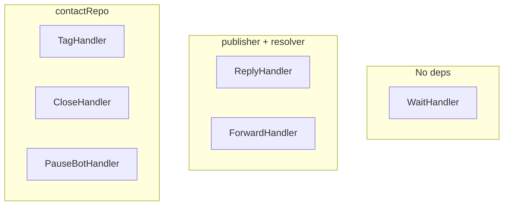

# Phase 24: Refactor Webhook Verbs Engine to Polymorphic VerbHandlers — RESEARCH

**Researched:** 2026-07-18
**Status:** Complete

---

## 1. Current VerbsEngine Architecture

### 1.1 Core File: [verbs.go](file:///home/pablo/Coding/PerGo/internal/webhook/verbs.go)

The entire verbs engine lives in a single 418-line file. The monolithic [Execute](file:///home/pablo/Coding/PerGo/internal/webhook/verbs.go#L92-L281) method does everything:

1. **Context setup** (L94): Creates 30s timeout context
2. **Payload parsing** (L98-L106): Unmarshals `InboundEventPayload` from `task.Payload` and parses `WorkspaceID`
3. **Contact resolution** (L109-L115): Calls `contactRepo.ResolveContact()` once to get `contactID`
4. **Execution loop** (L121-L275): Iterates over `[]Verb`, with a `switch` block dispatching to inline verb logic
5. **Logging** (L278): Logs all execution results via `logActionResults()`

### 1.2 VerbsEngine Struct

```go
type VerbsEngine struct {
    publisher   outbound.Publisher
    contactRepo *repository.ContactRepository  // concrete type, NOT interface
    logsRepo    *repository.UserActionLogRepository  // concrete type
    resolver    outbound.RouteResolver  // already an interface
}
```

> [!IMPORTANT]
> `contactRepo` and `logsRepo` are **concrete struct pointers**, not interfaces. The `publisher` and `resolver` fields are already interfaces (`outbound.Publisher` and `outbound.RouteResolver`). This means individual handlers receiving `contactRepo` will also use the concrete type unless we introduce a contact repository interface.

### 1.3 Constructor & Wiring

In [main.go:L236](file:///home/pablo/Coding/PerGo/cmd/pergo/main.go#L236):
```go
verbsEngine := webhook.NewVerbsEngine(publisher, contactRepo, userActionLogRepo, connectionRepo)
```

`connectionRepo` satisfies `outbound.RouteResolver` because `*repository.ConnectionRepository` implements [GetBySenderIdentity](file:///home/pablo/Coding/PerGo/internal/repository/connection.go#L115) and `GetDefaultChannelConnection`.

---

## 2. Verb Types Inventory

| Verb | Params Struct | Dependencies | Contact Required? |
|------|--------------|--------------|-------------------|
| `reply` | `ReplyParams{Body}` | `publisher`, `resolver` | No (uses `evt.From`) |
| `wait` | `WaitParams{Duration}` | None (pure timer) | No |
| `forward` | `ForwardParams{To, Channel}` | `publisher`, `resolver` | No (uses `evt.Body`) |
| `tag` | `TagParams{Tags}` | `contactRepo` | **Yes** (fails if `contactID == uuid.Nil`) |
| `close` | `CloseParams{}` | `contactRepo` | **Yes** |
| `pause_bot` | `PauseBotParams{Duration}` | `contactRepo` | **Yes** |

### Dependencies by Handler



### Handler-Specific Logic Details

**reply** ([L134-L147](file:///home/pablo/Coding/PerGo/internal/webhook/verbs.go#L134-L147)): Calls [executeReply](file:///home/pablo/Coding/PerGo/internal/webhook/verbs.go#L283-L324) which resolves connection via `resolver.GetBySenderIdentity()` → fallback to `GetDefaultChannelConnection()`, builds a `domain.QueueMessage`, and publishes to `messages.outbound`.

**wait** ([L149-L177](file:///home/pablo/Coding/PerGo/internal/webhook/verbs.go#L149-L177)): Parses duration, caps at 10s, clamps negative to 0, then `select` blocks on `time.After(d)` vs `ctx.Done()`.

**forward** ([L179-L192](file:///home/pablo/Coding/PerGo/internal/webhook/verbs.go#L179-L192)): Calls [executeForward](file:///home/pablo/Coding/PerGo/internal/webhook/verbs.go#L326-L362) — resolves default channel connection, builds `QueueMessage`, publishes.

**tag** ([L194-L213](file:///home/pablo/Coding/PerGo/internal/webhook/verbs.go#L194-L213)): Calls `contactRepo.AddTags()`.

**close** ([L215-L227](file:///home/pablo/Coding/PerGo/internal/webhook/verbs.go#L215-L227)): Calls `contactRepo.CloseThread()`.

**pause_bot** ([L229-L263](file:///home/pablo/Coding/PerGo/internal/webhook/verbs.go#L229-L263)): Most complex — parses optional duration, computes adjusted `pausedAt` timestamp (`now - 12h + duration`), calls `contactRepo.UpdateBotState()`.

---

## 3. Execution Flow & Shared Context

The current execution flow:

```
Execute(ctx, task, verbs)
  ├── Parse InboundEventPayload from task.Payload
  ├── Parse WorkspaceID (uuid)
  ├── Resolve ContactID via contactRepo.ResolveContact()
  ├── Loop over []Verb:
  │     ├── Check ctx.Done()
  │     ├── Switch on verb.Action
  │     ├── Unmarshal verb.Params into action-specific struct
  │     ├── Execute action logic
  │     └── On error: break loop (fail-fast)
  └── logActionResults() in background goroutine
```

### Data Available to Handlers

Per D-04 (shared `VerbContext` struct), handlers will receive:

| Field | Source | Used By |
|-------|--------|---------|
| `WorkspaceID` (`uuid.UUID`) | Parsed from `evt.WorkspaceID` | reply, forward, tag, close, pause_bot |
| `ContactID` (`uuid.UUID`) | Resolved via `contactRepo.ResolveContact()` | tag, close, pause_bot |
| `TraceID` (`string`) | `task.TraceID` | reply, forward |
| `InboundEventPayload` | Unmarshalled from `task.Payload` | reply (`From`, `Channel`, `To`), forward (`Body`) |

---

## 4. Decision Feasibility Validation

### D-01: Constructor Dependency Injection ✅ FEASIBLE

Each handler takes only its needed deps:
- `NewReplyHandler(publisher, resolver)` — matches existing `executeReply` deps
- `NewWaitHandler()` — no deps at all
- `NewForwardHandler(publisher, resolver)` — same as reply
- `NewTagHandler(contactRepo)` — single dep
- `NewCloseHandler(contactRepo)` — single dep
- `NewPauseBotHandler(contactRepo)` — single dep

**Risk:** `contactRepo` is a concrete `*repository.ContactRepository`, not an interface. This is fine for production DI but makes handler unit tests require a real DB or mock at the struct level. The existing tests already use a real DB via `getTestPoolWithMigrations()`, so this matches the project's testing style.

### D-02: Static Wiring in NewVerbsEngine Constructor ✅ FEASIBLE

The constructor already receives all 4 dependencies. The refactored version will:
1. Create individual handlers
2. Build a `map[string]VerbHandler` mapping
3. Store the map on the `VerbsEngine` struct

```go
func NewVerbsEngine(publisher outbound.Publisher, contactRepo *repository.ContactRepository, logsRepo *repository.UserActionLogRepository, resolver outbound.RouteResolver) *VerbsEngine {
    handlers := map[string]VerbHandler{
        "reply":     NewReplyHandler(publisher, resolver),
        "wait":      NewWaitHandler(),
        "forward":   NewForwardHandler(publisher, resolver),
        "tag":       NewTagHandler(contactRepo),
        "close":     NewCloseHandler(contactRepo),
        "pause_bot": NewPauseBotHandler(contactRepo),
    }
    return &VerbsEngine{handlers: handlers, logsRepo: logsRepo, contactRepo: contactRepo}
}
```

**Note:** `contactRepo` is still needed on the engine itself for the `ResolveContact()` call in the execution preamble. `logsRepo` is also retained for the `logActionResults()` call.

### D-03: Raw JSON Delegation (`Execute(ctx, verbCtx, params json.RawMessage) error`) ✅ FEASIBLE

The current code already uses `json.RawMessage` for `Verb.Params`. Each switch case already does its own `json.Unmarshal` into a private params struct. This maps 1:1 to the proposed interface.

### D-04: Shared VerbContext Struct ✅ FEASIBLE

All the data is already computed before the loop:
- `wsID` (L103-L106)
- `contactID` (L109-L115)
- `evt` (L98-L101) — the full `InboundEventPayload`

The struct would be:
```go
type VerbContext struct {
    WorkspaceID uuid.UUID
    ContactID   uuid.UUID
    TraceID     string
    Event       inbound.InboundEventPayload
}
```

### D-05: All Handlers in `internal/webhook/verb_handlers.go` ✅ FEASIBLE

No circular import issues — all deps (`outbound.Publisher`, `outbound.RouteResolver`, `*repository.ContactRepository`) are from lower-level packages that `webhook` already imports. The `webhook` package currently imports:
- `github.com/pablojhp.pergo/internal/domain`
- `github.com/pablojhp.pergo/internal/inbound`
- `github.com/pablojhp.pergo/internal/outbound`
- `github.com/pablojhp.pergo/internal/repository`

All of these will be needed by handlers and are already in the import graph.

---

## 5. Existing Patterns & Precedents

### Constructor DI Pattern

The project universally uses constructor injection. Examples:
- [NewDefaultDispatcher](file:///home/pablo/Coding/PerGo/internal/webhook/dispatcher.go#L83) — takes `SubscriptionStore`, `DLQStore`, `WorkspaceStore`, `HTTPClient`, `*VerbsEngine`
- [NewContactRepository](file:///home/pablo/Coding/PerGo/internal/repository/contact.go#L22) — takes `*pgxpool.Pool`

### Interface Definitions

Interfaces are defined in the consumer package (Go convention). Examples in the `webhook` package:
- [SubscriptionStore](file:///home/pablo/Coding/PerGo/internal/webhook/dispatcher.go#L22)
- [DLQStore](file:///home/pablo/Coding/PerGo/internal/webhook/dispatcher.go#L27)
- [WorkspaceStore](file:///home/pablo/Coding/PerGo/internal/webhook/dispatcher.go#L32)
- [HTTPClient](file:///home/pablo/Coding/PerGo/internal/webhook/dispatcher.go#L37)

The `VerbHandler` interface should follow this pattern — defined in `webhook` package.

### Mock Patterns in Tests

Tests use hand-written mocks (no testify/mock or mockgen). Examples in [dispatcher_test.go](file:///home/pablo/Coding/PerGo/internal/webhook/dispatcher_test.go):
- `mockSubscriptionStore`
- `mockDLQStore`
- `mockWorkspaceStore`
- `mockHTTPClient`
- `mockPublisher`
- `mockRouteResolver`

---

## 6. Webhook Package Structure

```
internal/webhook/
├── dispatcher.go       (237 lines) — WebhookDispatcher, DefaultDispatcher, HTTP dispatch + verbs invocation
├── dispatcher_test.go  (550 lines) — Integration tests with mocks + DB
├── verbs.go            (418 lines) — VerbsEngine, all verb types, execute logic, logging ← TARGET
├── verbs_test.go       (416 lines) — Integration tests with real PostgreSQL
├── wildcard.go         (28 lines)  — Event pattern matching utility
└── wildcard_test.go    (50 lines)  — Wildcard tests
```

After refactoring:
```
internal/webhook/
├── dispatcher.go
├── dispatcher_test.go
├── verbs.go             ← Slimmed: VerbHandler interface, VerbContext, VerbsEngine (loop + registration)
├── verb_handlers.go     ← NEW: All 6 handler implementations
├── verb_handlers_test.go← NEW: Unit tests for individual handlers
├── verbs_test.go        ← Updated: Integration tests (may need VerbContext adjustments)
├── wildcard.go
└── wildcard_test.go
```

---

## 7. Test Analysis

### Existing Tests in [verbs_test.go](file:///home/pablo/Coding/PerGo/internal/webhook/verbs_test.go)

| Test | What It Covers |
|------|---------------|
| "Normal sequential flow with tag and close" | Multi-verb sequence, DB state verification |
| "Wait cap enforcement" | Duration parsing, timing validation |
| "Parameter parsing errors" | Invalid duration, malformed JSON |
| "Context cancellation halts execution midway" | Context propagation, fail-fast |
| "Pause bot indefinitely" | pause_bot with empty params |
| "Pause bot with duration" | pause_bot with 2h duration, timestamp offset |
| "Pause bot with invalid duration" | Error on bad duration string |

**Key observation:** All tests use **real PostgreSQL** (`getTestPoolWithMigrations`). The engine is created with `webhook.NewVerbsEngine(nil, contactRepo, nil, nil)` — `publisher` and `resolver` are nil, so reply/forward are never tested here.

### Existing Tests in [dispatcher_test.go](file:///home/pablo/Coding/PerGo/internal/webhook/dispatcher_test.go#L380-L408)

The dispatcher integration test at L380 creates a full `VerbsEngine` with mocked `publisher` and `resolver` and a real `contactRepo`, testing the full dispatch → verbs execution path including `reply`, `tag`, and `close`.

### Impact on Tests

The refactoring must preserve:
1. **`NewVerbsEngine` constructor signature** — all 3 call sites must still work
2. **`Execute(ctx, task, verbs)` method signature** — unchanged for dispatcher
3. **Test assertions on DB state** — tag/close/pause_bot side effects

The `Verb`, `WebhookDeliveryTask`, and all params structs are exported and used in both test files.

---

## 8. Technical Risks & Mitigations

| Risk | Severity | Mitigation |
|------|----------|------------|
| Breaking `NewVerbsEngine` signature | HIGH | Keep exact same constructor params; only change internal wiring |
| Breaking `Execute` method signature | HIGH | Keep exact same `(ctx, task, verbs)` signature; VerbContext is internal to the loop |
| Params structs moved/renamed | MEDIUM | Keep all params structs exported from `webhook` package (they're referenced in tests) |
| `executeReply`/`executeForward` helper access | LOW | Move logic into handler `Execute` methods; delete old private helpers |
| `logActionResults` still needs engine-level deps | LOW | Keep `logsRepo` on engine, not on individual handlers |
| Contact resolution remains engine concern | LOW | Keep `contactRepo` on engine for `ResolveContact()` preamble; handlers receive `contactID` via `VerbContext` |

---

## 9. Recommended Implementation Approach

### Plan 1: Define Interface + VerbContext + Extract Handlers

**Tasks:**

1. **Define `VerbHandler` interface and `VerbContext` struct** in `verbs.go`:
   ```go
   type VerbHandler interface {
       Execute(ctx context.Context, vc VerbContext, params json.RawMessage) error
   }

   type VerbContext struct {
       WorkspaceID uuid.UUID
       ContactID   uuid.UUID
       TraceID     string
       Event       inbound.InboundEventPayload
   }
   ```

2. **Create `verb_handlers.go`** with 6 handler implementations:
   - `replyHandler` (unexported struct, exported constructor)
   - `waitHandler`
   - `forwardHandler`
   - `tagHandler`
   - `closeHandler`
   - `pauseBotHandler`

3. **Refactor `VerbsEngine`** struct to hold `handlers map[string]VerbHandler` and update `NewVerbsEngine` to wire the map statically. Keep `contactRepo` for preamble + `logsRepo` for logging.

4. **Refactor `Execute` loop** to look up handler from map and call `handler.Execute(ctx, vc, verb.Params)`. The "unknown action" case becomes a map miss. Error formatting changes from `verb %d (<action>)` to the same pattern via handler return.

5. **Move params structs to `verb_handlers.go`** (or keep them in `verbs.go` — they're exported and used externally). Safest: keep in `verbs.go` since tests reference `webhook.ReplyParams` etc.

6. **Delete `executeReply` and `executeForward`** private methods from `verbs.go` — absorbed into respective handlers.

7. **Update tests** — adjust any assertions that depend on exact error message formatting if it changes.

### Plan Separation Recommendation

This can be done in a **single plan** since:
- All changes are within `internal/webhook/` package
- No schema changes
- No external API changes
- No new dependencies
- The refactoring is mechanical (extract-and-delegate)

---

## 10. Validation Architecture

### How to Verify

1. **Existing integration tests pass unchanged** — `go test ./internal/webhook/ -v` should pass with the exact same test cases
2. **`main.go` compiles without changes** — constructor signature preserved
3. **New unit tests for individual handlers** — test each handler's `Execute` in isolation with mock/real deps
4. **Manual smoke test** — trigger a webhook with verb response and verify the full chain

### Key Assertions

- `VerbsEngine.Execute()` produces identical behavior for all 6 verb types
- Error messages maintain the `verb %d (<action>)` prefix pattern
- `logActionResults()` still captures per-verb success/failure logs
- Context cancellation still halts the loop mid-execution
- `wait` cap at 10s is preserved
- `pause_bot` timestamp math (`now - 12h + duration`) is preserved
- Handler map lookup for unknown verbs returns a clear error

---

## 11. Proposed Interface Contract

```go
// VerbHandler defines the polymorphic interface for verb action execution.
// Each handler is responsible for unmarshalling its own params from the raw JSON.
type VerbHandler interface {
    Execute(ctx context.Context, vc VerbContext, params json.RawMessage) error
}

// VerbContext carries shared execution state resolved once per verb block execution.
type VerbContext struct {
    WorkspaceID uuid.UUID
    ContactID   uuid.UUID                     // uuid.Nil if contact resolution failed
    TraceID     string
    Event       inbound.InboundEventPayload   // Full inbound event (From, To, Channel, Body, etc.)
}
```

This aligns exactly with D-03 and D-04. Handlers check `vc.ContactID == uuid.Nil` themselves when they require a contact.

---

## 12. Refactored VerbsEngine Struct

```go
type VerbsEngine struct {
    handlers    map[string]VerbHandler
    contactRepo *repository.ContactRepository    // needed for ResolveContact preamble
    logsRepo    *repository.UserActionLogRepository  // needed for logActionResults
}
```

The `publisher` and `resolver` fields are **removed** from `VerbsEngine` — they move into the individual `replyHandler` and `forwardHandler` structs.

---

*Phase: 24-refactor-webhook-verbs-engine-to-polymorphic-verbhandlers*
*Research completed: 2026-07-18*
