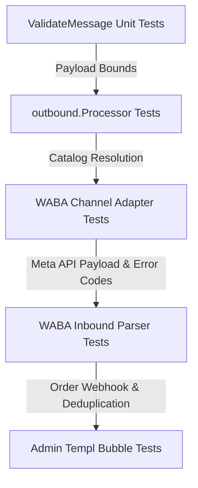

# Phase 33: Commerce Catalogs & Order Processing - Research

**Researched:** 2026-07-30  
**Target Milestone:** v1.7 WABA Deep Integration  
**Requirements Covered:** COMM-01, COMM-02, COMM-03, COMM-04, COMM-05  

---

## Executive Summary

Phase 33 delivers complete Meta WhatsApp Business API (WABA) Commerce capabilities for PerGo. It enables operators to dispatch single-product messages (`type: "product"`) and multi-product list messages (`type: "product_list"`), configure a connection-level `default_catalog_id` in WABA settings, perform synchronous pre-flight catalog and SKU payload validation before queueing, parse inbound WhatsApp order webhooks (`type == "order"`) into normalized `order.created` events with idempotent `wamid` deduplication, and render formatted order summary bubbles and product cards in the admin Chat UI.

By embedding pre-flight payload validation and Meta error translation at ingestion and dispatch, PerGo guarantees strict data integrity for catalog routing while giving developers and UI operators clean trace visibility over commerce orders.

---

## Key Findings & Architecture Analysis

### 1. Message Domain Structures (`internal/domain/message.go` & `internal/domain/event.go`)

To support WABA single-product and multi-product list dispatches as well as inbound order event normalization, new domain types and constants are required:

#### A. Outbound Message Payload Extensions (`internal/domain/message.go`)
- **Message Types**:
  ```go
  const (
      MessageTypeProduct     = "product"
      MessageTypeProductList = "product_list"
  )
  ```
- **Product Domain Structures**:
  ```go
  // ProductItem defines an individual catalog item SKU and optional price metadata.
  type ProductItem struct {
      ProductRetailerID string  `json:"product_retailer_id"` // SKU / Retailer ID (required)
      ItemPrice         float64 `json:"item_price,omitempty"`
      Currency          string  `json:"currency,omitempty"`
      Quantity          int     `json:"quantity,omitempty"`
  }

  // ProductSection defines a titled section containing multiple catalog items.
  type ProductSection struct {
      Title        string        `json:"title,omitempty"` // Section title (max 24 chars)
      ProductItems []ProductItem `json:"product_items"`
  }

  // ProductPayload defines product metadata attached to a message request.
  type ProductPayload struct {
      CatalogID         string           `json:"catalog_id,omitempty"`          // Meta Catalog ID
      ProductRetailerID string           `json:"product_retailer_id,omitempty"` // For single product
      Header            string           `json:"header,omitempty"`
      Body              string           `json:"body,omitempty"`
      Footer            string           `json:"footer,omitempty"`
      Sections          []ProductSection `json:"sections,omitempty"`            // For product list (max 10 sections)
  }
  ```
- **Request Integration**:
  Add `Type string json:"type,omitempty"` and `Product *ProductPayload json:"product,omitempty"` to `CreateMessageRequest` and `QueueMessage`. This permits both explicit top-level typing (`"type": "product"`) and structured nested product payloads.

#### B. Inbound Order Event Schema (`internal/domain/event.go`)
- **Webhook Event Type**:
  ```go
  const EventTypeOrderCreated EventType = "order.created"
  ```
- **Order Structure**:
  ```go
  type OrderProductItem struct {
      ProductRetailerID string  `json:"product_retailer_id"`
      Quantity          int     `json:"quantity"`
      ItemPrice         float64 `json:"item_price"`
      Currency          string  `json:"currency"`
  }

  type OrderCreatedEvent struct {
      OrderID    string             `json:"order_id"`
      CatalogID  string             `json:"catalog_id"`
      Items      []OrderProductItem `json:"items"`
      TotalPrice float64            `json:"total_price"`
      Currency   string             `json:"currency"`
      Wamid      string             `json:"wamid"`
      ContactID  string             `json:"contact_id"`
      TraceID    string             `json:"trace_id"`
  }
  ```

---

### 2. Database Schema & Repository for WABA Connections (`internal/repository/connection.go`)

PerGo stores channel credentials in the `connections` table inside an encrypted JSON blob (`credentials` column, encrypted via AES-256-GCM KEK).

- **`WABAConfig` Struct Update**:
  Add `DefaultCatalogID string json:"default_catalog_id,omitempty"` to `WABAConfig` in `internal/channel/whatsapp/waba.go`:
  ```go
  type WABAConfig struct {
      PhoneNumberID    string `json:"phone_number_id"`
      Token            string `json:"token"`
      WABAAccountID    string `json:"waba_account_id"`
      VerifyToken      string `json:"verify_token"`
      DefaultCatalogID string `json:"default_catalog_id,omitempty"` // Connection default catalog
  }
  ```
- **No Database Schema Migration Required**: Because `credentials` is stored as an encrypted JSON byte array (`BYTEA`), extending `WABAConfig` requires zero SQL schema migrations. The `ConnectionRepository.GetByID` method automatically decrypts and exposes `DefaultCatalogID`.

---

### 3. Ingestion Handler & Pre-flight Validation (`internal/api/handler/message.go` & `internal/outbound/processor.go`)

#### A. Resolution Precedence (D-07, COMM-03)
When `POST /messages` comes in for `type: "product"` or `type: "product_list"`:
1. Use explicit `catalog_id` in request payload (`req.Product.CatalogID`).
2. Fall back to `default_catalog_id` in connection credentials (`WABAConfig.DefaultCatalogID`).
3. If both are missing, reject synchronously with HTTP 422 `missing_catalog_id`:
   ```json
   {
     "code": "missing_catalog_id",
     "message": "catalog_id is required for product messages and no default_catalog_id is configured for connection"
   }
   ```

#### B. Pre-flight Catalog & SKU Structural Bounds (D-01, COMM-01, COMM-02, COMM-05)
Validate synchronously during `ValidateMessage` / `outbound.Processor.Ingest`:
- **Single Product (`type: "product"`)**:
  - `product_retailer_id` (SKU) must be non-empty.
- **Multi-Product List (`type: "product_list"`)**:
  - Number of sections: `1 <= len(sections) <= 10`.
  - Section title limit: `len(section.Title) <= 24` characters.
  - Total items across all sections: `total_items <= 30`.
  - Item SKU check: Every `product_item` must have a non-empty `product_retailer_id`.
- Failure returns HTTP 422 `invalid_product_payload` with field-level details before any NATS JetStream enqueue occurs.

---

### 4. Outbound WABA Channel Adapter (`internal/channel/whatsapp/waba.go`)

#### A. Meta Graph API Formatting
WABA requires interactive message payloads:
- **Single Product (`type: "product"`)**:
  ```json
  {
    "messaging_product": "whatsapp",
    "recipient_type": "individual",
    "to": "<recipient>",
    "type": "interactive",
    "interactive": {
      "type": "product",
      "body": { "text": "<body_text>" },
      "footer": { "text": "<footer_text>" },
      "action": {
        "catalog_id": "<catalog_id>",
        "product_retailer_id": "<product_retailer_id>"
      }
    }
  }
  ```
- **Product List (`type: "product_list"`)**:
  ```json
  {
    "messaging_product": "whatsapp",
    "recipient_type": "individual",
    "to": "<recipient>",
    "type": "interactive",
    "interactive": {
      "type": "product_list",
      "header": { "type": "text", "text": "<header_text>" },
      "body": { "text": "<body_text>" },
      "footer": { "text": "<footer_text>" },
      "action": {
        "catalog_id": "<catalog_id>",
        "sections": [
          {
            "title": "<section_title>",
            "product_items": [
              { "product_retailer_id": "<sku_1>" },
              { "product_retailer_id": "<sku_2>" }
            ]
          }
        ]
      }
    }
  }
  ```

#### B. Meta Graph API Error Mapping (D-02)
Update `classifyError` in `waba.go`:
- Code `131009`: Catalog ID invalid / unlinked.
- Code `131084`: Product SKU / Retailer ID does not exist in bound catalog.
- Mark these error codes as **terminal errors** (`channel.NewTerminalError(...)`) to prevent useless worker retries, emitting a normalized `order_dispatch_failed` / `invalid_sku` delivery failure event with trace correlation.

---

### 5. Inbound WABA Webhook Parser (`internal/api/handler/waba_webhook.go` & `internal/channel/whatsapp/waba_inbound.go`)

When a Meta webhook for an inbound order arrives (`messages[].type == "order"`):

1. **Payload Parsing**:
   - `WABAInboundAdapter.Parse` extracts `order.catalog_id`, customer notes (`order.text`), and `product_items` list (`product_retailer_id`, `quantity`, `item_price`, `currency`).
   - Builds a readable text summary for `InboundEvent.Body`.
2. **Idempotent Deduplication (D-04)**:
   - `InboundProcessor.Process` invokes `dedupRepo.InsertAndCheck(workspaceID, "whatsapp_cloud", msg.ID)` using the Meta `wamid`.
   - If `unique == false`, duplicate webhook retries from Meta are immediately ignored, preventing duplicate `order.created` event emissions.
3. **Normalized `order.created` Event Emission (D-03)**:
   - Calculates `total_price` = $\sum (\text{quantity} \times \text{item\_price})$.
   - Publishes `OrderCreatedEvent` payload via `InboundProcessor.PublishOrderCreated(ctx, workspaceID, orderEv)` to NATS `inbound.events.<workspace_id>` and downstream webhooks.
   - Stores raw order details inside `messages.metadata` for history logging.

---

### 6. Admin UI Chat Rendering (`templates/components/message_bubble.templ`)

- **Inbound Order Summary Bubble (D-05)**:
  Renders an inbox chat bubble with:
  - 🏷️ Catalog ID badge
  - 📦 Item breakdown table (SKU, quantity, unit price, line subtotal)
  - 💳 Price total & currency badge
  - 💬 Customer note callout
- **Outbound Product Catalog Card**:
  Renders outbound `product` and `product_list` messages as catalog cards styled with Tailwind CSS, displaying catalog badge, title, section count, and item SKUs.

---

## Validation Architecture (Nyquist Requirements)

To satisfy PerGo's automated test verification standards, Phase 33 implementation must include the following test suites:



### Test Suite Breakdown

1. **`internal/domain/message_test.go`**:
   - Single product payload validation (missing `product_retailer_id` failure).
   - Product list section/item bounds testing (>10 sections, >30 total items, section title >24 chars failure).
2. **`internal/outbound/processor_test.go`**:
   - Test resolution order: payload `catalog_id` > connection `default_catalog_id` > missing 422 rejection.
3. **`internal/channel/whatsapp/waba_test.go`**:
   - Format unit tests for `type: "product"` and `type: "product_list"` interactive JSON payloads.
   - Meta error handling: verify error codes `131009` and `131084` return `channel.TerminalError`.
4. **`internal/api/handler/waba_webhook_test.go`**:
   - Inbound `messages[].type == "order"` webhook test.
   - Idempotent `wamid` deduplication check.
   - `order.created` NATS event emission assertion.
5. **`templates/components/message_bubble_test.go`**:
   - Templ component render tests verifying order summary bubble and product card HTML output.

---

## Risk Analysis & Mitigation

| Risk | Cause | Impact | Mitigation Strategy |
|------|-------|--------|---------------------|
| Missing `catalog_id` | API request omits `catalog_id` and WABA connection has no `default_catalog_id` | Outbound message fails at Meta API | Synchronous pre-flight check returning HTTP 422 `missing_catalog_id` at ingestion |
| SKU mismatch (Code 131084) | Product SKU in request does not exist in Meta Commerce Catalog | Dispatch failure loop | Classify Meta code 131084 as terminal error; halt retries immediately |
| Duplicate `order.created` webhooks | Meta re-sends order webhook on transient network retry | Duplicate webhook events emitted to client webhooks | Primary key insert check on `wamid` in `inbound_dedup` before emitting event |
| Oversized product list payload | Client submits >10 sections or >30 items | Rejected by Meta API | Enforce strict pre-flight bounds validation in `domain.ValidateMessage` |

---

## Implementation Pitfalls & Gotchas

1. **Section Title Character Limit**: Meta restricts section titles in `product_list` to **24 characters**. Validate this pre-flight; otherwise Meta returns a generic payload error.
2. **Total Item Bound (30 items)**: The 30-item limit is cumulative across **all sections** in a `product_list`, not 30 items per section.
3. **Price Unit Format in Meta Webhooks**: Meta Graph API transmits `item_price` in order webhooks as numeric strings or floats (e.g., `49.99` or integer unit amount in cents depending on account currency settings). Parse defensively into `float64`.
4. **WABA 24-Hour Session Window Interaction**: Product messages (`type: "product"`, `type: "product_list"`) are freeform interactive messages. They require an active 24h customer session window. If sent outside the 24h window without an approved Commerce template, `IsWindowOpen` check will fail with `SESSION_WINDOW_EXPIRED`.

---

## Recommended Plan Slices / Task Breakdown

- **Plan 1: Domain & Repository Foundation**
  - Add `MessageTypeProduct`, `MessageTypeProductList`, `ProductItem`, `ProductSection`, `ProductPayload` in `internal/domain/message.go`.
  - Add `EventTypeOrderCreated` and `OrderCreatedEvent` in `internal/domain/event.go`.
  - Extend `WABAConfig` with `DefaultCatalogID` in `internal/channel/whatsapp/waba.go`.
  - Write domain validation unit tests in `internal/domain/message_test.go`.

- **Plan 2: Ingestion Handler & Pre-flight Validation**
  - Implement `default_catalog_id` resolution logic and product bounds validation in `internal/outbound/processor.go` and `internal/api/handler/message.go`.
  - Return HTTP 422 `missing_catalog_id` and `invalid_product_payload`.
  - Write ingestion tests in `internal/outbound/processor_test.go`.

- **Plan 3: Outbound WABA Channel Adapter & Meta Error Mapping**
  - Implement interactive `product` and `product_list` JSON formatters in `internal/channel/whatsapp/waba.go`.
  - Map Meta Graph API error codes `131009` and `131084` to terminal errors.
  - Write channel adapter tests in `internal/channel/whatsapp/waba_test.go`.

- **Plan 4: Inbound Webhook Parser & `order.created` Event Emission**
  - Implement inbound `type == "order"` parser in `internal/channel/whatsapp/waba_inbound.go` and `internal/api/handler/waba_webhook.go`.
  - Add `PublishOrderCreated` method to `InboundProcessor` in `internal/inbound/processor.go`.
  - Enforce `wamid` deduplication prior to event emission.
  - Write webhook integration tests in `internal/api/handler/waba_webhook_test.go`.

- **Plan 5: Inbox Chat UI Order & Product Bubbles**
  - Create visual Templ components for WhatsApp order summary bubbles and product catalog cards in `templates/components/message_bubble.templ`.
  - Verify UI rendering with component unit tests.

---

## RESEARCH COMPLETE
