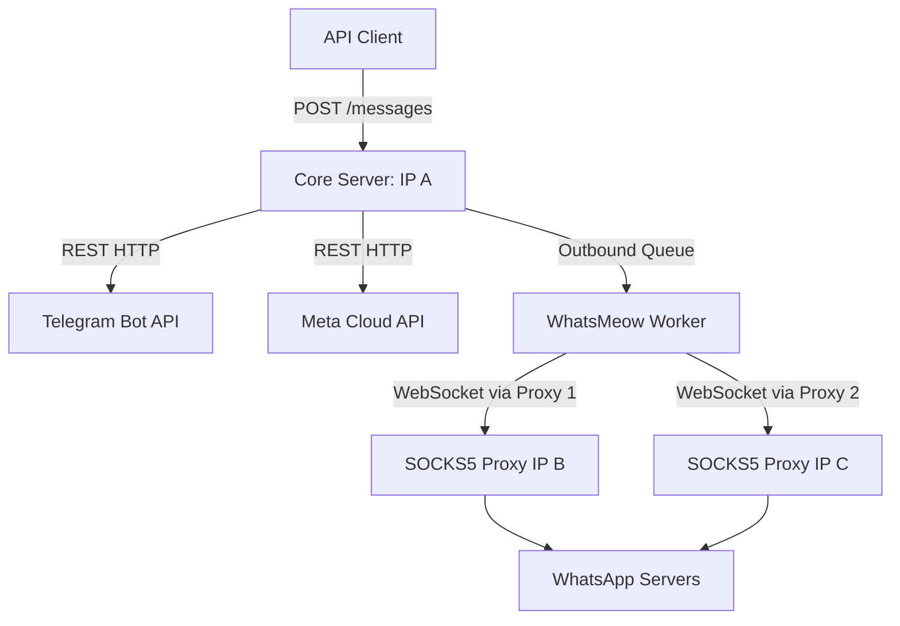

# CPaaS Monetization & Proxy Architecture

## Business Decisions

1. **Hybrid Open-Core Model:**
   - Keep the core engine open-source (MIT/AGPL) to drive organic developer traction and distribution.
   - **Self-Hosted Enterprise:** Sell premium license keys for advanced on-prem enterprise features (SSO/SAML, advanced SLA support, multi-tenant workspace isolation, fine-grained analytics).
   - **Managed Cloud SaaS:** Provide a fully hosted version of PerGo where users pay for convenience, deliverability, and maintenance.

2. **Managed Cloud Pricing Model:**
   - Charge a flat monthly fee per active connection type (e.g., $15/mo for WhatsApp Web, $5/mo for Telegram/WABA).
   - Stateful connections (WhatsApp Web) consume server memory/CPU permanently, justifying a higher price than stateless connections (Telegram/WABA).

## Technical Architecture: Proxy & Traffic Isolation

To safeguard the Managed Cloud platform from IP address bans by WhatsApp, we adopt a **Proxy/Worker Traffic Isolation** architecture:

### Key Implementation Principles

1. **IP Isolation:**
   - The Core Server, API endpoints, webhooks, WABA, and Telegram REST calls run on a "clean" main IP (IP A).
   - whatsmeow Web sessions are routed dynamically through distinct outbound IP addresses (SOCKS5/HTTP proxies).
   - A block on a whatsmeow IP does not affect official channels, webhooks, or the admin dashboard.

2. **Proxy Rotation & Monitoring:**
   - The system must monitor whatsmeow WebSocket connection statuses.
   - If a connection fails or is blocked, the worker automatically rotates the SOCKS5 proxy IP associated with that connection and reconnects the client.
