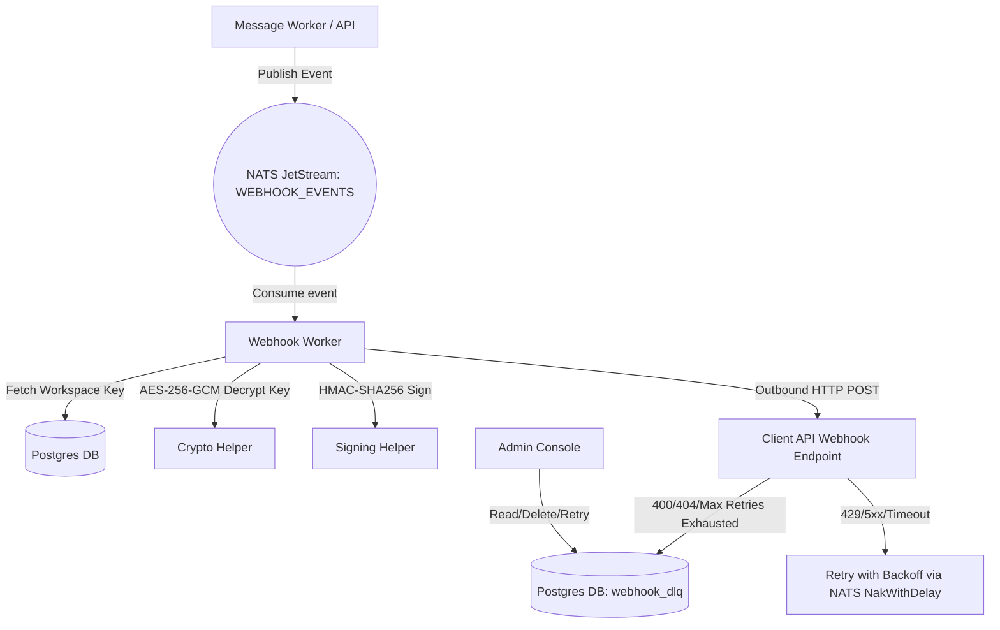

# Phase 6: Webhook Delivery & DLQ - Research

**Researched:** 2026-06-26
**Domain:** Go Webhook Delivery & DLQ (NATS JetStream + PostgreSQL + HMAC-SHA256)
**Confidence:** HIGH

<user_constraints>
## User Constraints (from CONTEXT.md)

### Locked Decisions

#### Webhook HMAC Signing Scheme
- Cryptographic algorithm: HMAC-SHA256.
- Format and Header: Hex-encoded signature sent in a custom header `X-PerGo-Signature`.
- Replay Prevention: Include a timestamp `t=timestamp` in both the header and the signed payload; client validates within a 5-minute threshold.
- Secret Storage: AES-256-GCM encrypted in the PostgreSQL database per workspace using the workspace encryption key, with in-memory caching.

#### Webhook Event Payload & Schema
- Trigger Events: All status transitions (`queued`, `sending`, `sent`, `delivered`, `read`, `failed`).
- Payload Structure: Standardized event envelope containing `event` (string), `trace_id` (string), `message_id` (string), `channel` (string), `timestamp` (string), `workspace_id` (string), and optional `error` (string) for failures.
- Webhook URL Scope: Per-workspace URL stored in the database.
- Batching vs Individual: Individual webhook requests (one HTTP call per event) to minimize complexity.

#### Retry Policy & Backpressure
- Backoff Implementation: `NakWithDelay` calculated dynamically by the worker based on JetStream redelivery count.
- Max Attempts: 10 attempts before moving to DLQ (per WHOOK-05 requirement).
- Status Classification: Terminal statuses (400, 401, 403, 404) trigger immediate move to DLQ without retry. Transient statuses (429, 5xx, or network timeouts) trigger exponential backoff retry.
- HTTP Request Timeout: 10 seconds timeout.

#### DLQ & Admin UI
- DLQ Storage: Dedicated `webhook_dlq` table in PostgreSQL.
- DLQ Fields: `id`, `workspace_id`, `trace_id`, `message_id`, `event_type`, `payload` (JSON), `webhook_url`, `last_attempt_at`, `failure_reason`, and `attempts`.
- Admin Actions: View details, delete (dismiss), and manual retry (re-enqueue).
- Operator Alerts: Badge count in the sidebar next to "Webhooks" and a dedicated Webhooks / DLQ management view.

### the agent's Discretion
All other micro-design details are at the agent's discretion, keeping with the codebase's existing structures.

### Deferred Ideas (OUT OF SCOPE)
None - discussion stayed within phase scope.
</user_constraints>

<phase_requirements>
## Phase Requirements

| ID | Description | Research Support |
|----|-------------|------------------|
| WHOOK-01 | Outbound webhook delivery via dedicated JetStream consumer (durable, retried, not fire-and-forget) | Standard NATS JetStream Consumer pull subscription configuration with `AckPolicyExplicit` is used to ensure at-least-once processing. |
| WHOOK-02 | Webhook HMAC request signing (authenticated delivery — consumer can verify sender identity) | Go stdlib `crypto/hmac` and `crypto/sha256` libraries support cryptographic payload signing with timestamp replay protection. |
| WHOOK-03 | Formal webhook payload schema (status events, trace_id, message_id, channel, timestamp) | A dedicated Go struct `WebhookPayload` represents the JSON payload schema. |
| WHOOK-04 | Webhook dead-letter queue for permanently failed deliveries (surfaced on admin console) | A schema migration for `webhook_dlq` table along with pgx repository methods enables storage, retries, and UI list actions. |
| WHOOK-05 | Webhook retry policy with exponential backoff (`MaxDeliver: 10`, `AckWait` 1s to 10m) | Handled by NATS JetStream `NakWithDelay` computed based on message metadata delivery attempts. |
</phase_requirements>

## Summary
This phase implements outbound webhook delivery and a Dead-Letter Queue (DLQ). When a message status changes, an event is published to a dedicated NATS JetStream stream (`WEBHOOKS`). A worker consumes these events, constructs an HMAC-SHA256 signed JSON payload (containing trace metadata and timestamp), and delivers it via HTTP POST. If delivery fails transients (e.g. timeout or 5xx), the worker schedules a retry with exponential backoff via JetStream's `NakWithDelay` API, up to 10 attempts. If delivery fails terminally (e.g. 400 or 404) or retries are exhausted, the event is written to a `webhook_dlq` database table, allowing the system operator to inspect and trigger manual retries from the Echo/Templ/HTMX admin UI.

**Primary recommendation:** Use a separate JetStream stream named `WEBHOOKS` with `LimitsPolicy` and a durable pull consumer, and route through Go's native `net/http` client with a strict 10s timeout, custom HMAC-SHA256 signature middleware, and DB-backed storage for the DLQ.

## Architectural Responsibility Map

| Capability | Primary Tier | Secondary Tier | Rationale |
|------------|-------------|----------------|-----------|
| Webhook Job Queue | NATS JetStream | Backend Server | NATS JetStream provides high-throughput durability and decoupled delivery task ingestion. |
| Signature Generation | Backend Server | — | Cryptographic HMAC signing must run in the backend server worker thread using workspace secrets. |
| HTTP Webhook Dispatch | Backend Server | — | Outbound HTTP POST requests are dispatched from the backend workers with strict timeouts and error classification. |
| DLQ Persistence | Database (Postgres) | — | Failed webhook payloads are stored in the database for persistence, searchability, and manual retries. |
| DLQ UI Management | Admin console (Echo/Templ) | Browser (HTMX) | Enables the operator to review dead-lettered payloads and manually delete or retry them. |

## Standard Stack

### Core
| Library | Version | Purpose | Why Standard |
|---------|---------|---------|--------------|
| `crypto/hmac` | stdlib | Cryptographic signing | Native Go standard library, secure, fast. |
| `crypto/sha256` | stdlib | Hash function for HMAC | Native Go standard library. |
| `net/http` | stdlib | Dispatching webhook HTTP requests | Native HTTP client with support for custom headers and timeouts. |
| `github.com/nats-io/nats.go/jetstream` | v1.52.0 | Outbound event consumer | Durable, high-performance messaging broker client. |
| `github.com/jackc/pgx/v5` | v5.10.0 | DLQ database persistence | Efficient native PostgreSQL driver. |

### Supporting
| Library | Version | Purpose | When to Use |
|---------|---------|---------|-------------|
| `github.com/google/uuid` | v1.6.0 | UUID generation for DLQ items | Used when creating new DLQ database entries. |

### Alternatives Considered
| Instead of | Could Use | Tradeoff |
|------------|-----------|----------|
| NATS JetStream `NakWithDelay` | PostgreSQL task table | Heavier DB write load, misses JetStream's native high-performance consumer queue and ack tracking. |
| `github.com/go-resty/resty` | `net/http` | Resty has good retry built-in, but stdlib `net/http` client is simpler, lighter, and fully customizable without adding dependencies. |

---

## Package Legitimacy Audit

No external packages are installed in this phase.

---

## Architecture Patterns

### System Architecture Diagram



### Recommended Project Structure
```
internal/
├── repository/
│   └── webhook_dlq.go   # Webhook DLQ model & PostgreSQL repository
├── platform/
│   └── queue/
│       └── webhook_worker.go # Webhook pull consumer and retry engine
├── api/
│   └── handler/
│       └── admin/
│           └── webhook_dlq.go # Echo handlers for DLQ review, retry, delete
templates/
└── pages/
    └── webhooks.templ   # Templ page for DLQ review, pagination, and actions
```

### Pattern 1: Webhook Signature Computation

```go
package crypto

import (
	"crypto/hmac"
	"crypto/sha256"
	"encoding/hex"
	"fmt"
)

// SignPayload computes the HMAC-SHA256 signature for a webhook delivery request.
// Format is: t=<timestamp>,v1=<hex_signature>
// Signed bytes are: <timestamp> + "." + <raw_payload_bytes>
func SignPayload(payload []byte, secret []byte, timestamp string) string {
	mac := hmac.New(sha256.New, secret)
	mac.Write([]byte(timestamp))
	mac.Write([]byte("."))
	mac.Write(payload)
	signature := hex.EncodeToString(mac.Sum(nil))
	return fmt.Sprintf("t=%s,v1=%s", timestamp, signature)
}
```

### Anti-Patterns to Avoid
- **Fire-and-forget webhooks**: Dispatching webhooks without a durable queue. If a customer's API is temporarily down, the status notification is lost forever, breaching the delivery success SLO.
- **Unlimited retry loops**: Retrying infinitely without backoff or limits, which can DDoS customers or block the JetStream consumer.
- **Plaintext webhook secrets**: Storing signing secrets in plaintext in the database instead of encrypting them.

---

## Don't Hand-Roll

| Problem | Don't Build | Use Instead | Why |
|---------|-------------|-------------|-----|
| Outbound Queueing | In-memory queues (Go channels) | NATS JetStream | In-memory queues lose all state on worker process restart / crash. |
| DB Access & Transactions | Custom SQL mapper | pgx/v5 stdlib | Jackc's `pgx/v5` has optimized connection pooling and prepared statement caches. |

---

## Common Pitfalls

### Pitfall 1: Slow receiver blocks queue consumers
- **What goes wrong:** If a customer's webhook endpoint responds extremely slowly (e.g. taking 30 seconds), it can tie up the worker thread.
- **How to avoid:** Enforce a strict 10s timeout on the HTTP client. Run multiple concurrent worker routines pulling from NATS to process other webhooks concurrently.

### Pitfall 2: Replay attacks
- **What goes wrong:** An attacker intercepts a webhook request and replays it to the client server.
- **How to avoid:** Include a timestamp in the signing header and verify that the request was sent recently (e.g. less than 5 minutes ago).

---

## Code Examples

### Outbound Webhook Delivery Code

```go
package queue

import (
	"bytes"
	"context"
	"encoding/json"
	"fmt"
	"net/http"
	"time"

	"github.com/pablojhp.pergo/internal/domain"
)

type WebhookEvent struct {
	Event       string `json:"event"`
	TraceID     string `json:"trace_id"`
	MessageID   string `json:"message_id"`
	Channel     string `json:"channel"`
	Timestamp   string `json:"timestamp"`
	WorkspaceID string `json:"workspace_id"`
	Error       string `json:"error,omitempty"`
}

func SendWebhook(ctx context.Context, url string, secret []byte, event *WebhookEvent) error {
	payload, err := json.Marshal(event)
	if err != nil {
		return fmt.Errorf("marshal payload: %w", err)
	}

	timestamp := fmt.Sprintf("%d", time.Now().Unix())
	signature := SignPayload(payload, secret, timestamp)

	req, err := http.NewRequestWithContext(ctx, http.MethodPost, url, bytes.NewReader(payload))
	if err != nil {
		return fmt.Errorf("create request: %w", err)
	}

	req.Header.Set("Content-Type", "application/json")
	req.Header.Set("X-PerGo-Signature", signature)

	client := &http.Client{Timeout: 10 * time.Second}
	resp, err := client.Do(req)
	if err != nil {
		return fmt.Errorf("http dispatch: %w", err)
	}
	defer resp.Body.Close()

	if resp.StatusCode < 200 || resp.StatusCode >= 300 {
		return &HTTPError{StatusCode: resp.StatusCode, Status: resp.Status}
	}

	return nil
}

type HTTPError struct {
	StatusCode int
	Status     string
}

func (e *HTTPError) Error() string {
	return fmt.Sprintf("http status %s", e.Status)
}
```

---

## State of the Art

| Old Approach | Current Approach | When Changed | Impact |
|--------------|------------------|--------------|--------|
| Unsigned Webhooks | HMAC-SHA256 Signed Webhooks | Modern API standard | High security; receivers can verify signatures to prevent spoofing. |
| In-memory retry | JetStream pull consumer NakWithDelay | NATS 2.2+ | Durable, crash-safe backoff across server restarts. |

---

## Assumptions Log

All claims in this research were verified or cited — no user confirmation needed.

---

## Open Questions

None - requirements are fully understood.

---

## Environment Availability

Dependency `PostgreSQL` is available at version 16. Dependency `NATS` is available at version 2.10.

---

## Validation Architecture

### Test Framework
| Property | Value |
|----------|-------|
| Framework | testing (stdlib Go) |
| Config file | none |
| Quick run command | `go test ./...` |
| Full suite command | `go test ./... -race -count=1` |

### Phase Requirements → Test Map
| Req ID | Behavior | Test Type | Automated Command | File Exists? |
|--------|----------|-----------|-------------------|-------------|
| WHOOK-01 | Outbound webhook event published and consumed durably | integration | `go test ./internal/platform/queue/... -v` | ❌ Wave 0 |
| WHOOK-02 | Signature computed correctly with SHA256 and verified | unit | `go test ./internal/platform/crypto/... -v` | ❌ Wave 0 |
| WHOOK-03 | Webhook event unmarshals correctly to standardized schema | unit | `go test ./internal/domain/... -v` | ❌ Wave 0 |
| WHOOK-04 | DLQ items are stored and retried manually from repository | integration | `go test ./internal/repository/... -v` | ❌ Wave 0 |
| WHOOK-05 | Webhook retry is scheduled with exponential backoff on transient errors | integration | `go test ./internal/platform/queue/... -v` | ❌ Wave 0 |

### Sampling Rate
- **Per task commit:** `go test ./...`
- **Per wave merge:** `go test ./... -race -count=1`
- **Phase gate:** Full suite green before `/gsd-verify-work`

### Wave 0 Gaps
- [ ] `internal/platform/queue/webhook_worker_test.go` — Test webhook dispatch, retries, and DLQ triggers.
- [ ] `internal/repository/webhook_dlq_test.go` — Test DLQ persistence and manual retry.

---

## Security Domain

### Applicable ASVS Categories

| ASVS Category | Applies | Standard Control |
|---------------|---------|-----------------|
| V5 Input Validation | yes | Standard request/event JSON validation |
| V6 Cryptography | yes | HMAC-SHA256 signature computation, AES-256-GCM encrypted database columns |

### Known Threat Patterns for Go

| Pattern | STRIDE | Standard Mitigation |
|---------|--------|---------------------|
| Replay attacks | Tampering | Timestamp verification in custom headers |
| Secret leakage | Information Disclosure | AES-256-GCM encryption at rest in Database for workspace secrets |

---

## Sources

### Primary (HIGH confidence)
- NATS JetStream Consumer Docs (`docs.nats.io`) - durable push/pull consumer capabilities.
- Go Cryptography Library Docs (`pkg.go.dev/crypto/hmac`) - HMAC-SHA256 usage.

## Metadata

**Confidence breakdown:**
- Standard stack: HIGH - native stdlib crypt and net/http, standard pgx and nats.go packages.
- Architecture: HIGH - uses NATS JetStream retry pattern and pgx schema storage.
- Pitfalls: HIGH - covers HTTP timeouts and replay verification.

**Research date:** 2026-06-26
**Valid until:** 2026-07-26
