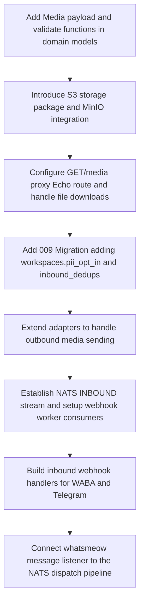

# Phase 7: Media & Inbound — Research Findings

## Summary of Findings

1. **S3 / MinIO Integration via `aws-sdk-go-v2`**:
   - The Go AWS SDK v2 (`github.com/aws/aws-sdk-go-v2`) is highly modular. To configure a client that works seamlessly with AWS S3 and self-hosted S3-compatible alternatives like MinIO, we must use `config.LoadDefaultConfig` and customize the client options using `s3.Options.BaseEndpoint` (for the endpoint URL) and `s3.Options.UsePathStyle` (set to `true` for path-style bucket addressing needed by MinIO).
   - For file size limit enforcement (25MB max), downloading using an `io.LimitReader` coupled with an HTTP GET timeout (30 seconds) allows us to safely abort large payloads before parsing or storing them. Content hash identification (SHA-256) is utilized to ensure content-addressed S3 storage (`{workspace_id}/{content_hash}.{ext}`), preventing duplication of blobs and facilitating deduplicated uploads.

2. **Inbound Webhook Payload & NATS Routing**:
   - A dedicated `INBOUND` stream must be created in NATS JetStream, monitoring subjects matching `inbound.events.*` (where `*` is the workspace UUID).
   - The existing `WebhookWorker` should be extended to consume events from both the existing `WEBHOOKS` and new `INBOUND` stream. This is achieved by registering a secondary pull consumer (e.g. `inbound-webhooks-consumer`) in the webhook worker loop.
   - PII protection requires that if a workspace has `pii_opt_in` configured to `false`, the webhook worker must redact/mask the sender's phone number (`from` field) and completely strip location and contact arrays before dispatching payloads to the consumer URL.

3. **whatsmeow Inbound Event Loop**:
   - whatsmeow's event handler triggers on `*waEvents.Message`. To extract content, we must inspect and type-assert the message contents (`v.Message`), switching on various message types like `GetImageMessage()`, `GetDocumentMessage()`, `GetAudioMessage()`, `GetVideoMessage()`, `GetLocationMessage()`, `GetContactMessage()`, and `GetContactsArrayMessage()`.
   - Media attachments can be decrypted and downloaded as raw bytes using whatsmeow client's built-in `wc.Client().Download()` method, which accepts any type implementing `whatsmeow.DownloadableMessage`.

4. **Telegram Webhook Parsing & Media Download**:
   - Telegram sends message objects via webhook. Text is in `.Text`, locations are in `.Location`, contacts are in `.Contact`. Media objects (photo, document, audio, video) contain a `file_id`.
   - To download a media attachment, PerGo must first call Telegram's `getFile?file_id=<FILE_ID>` API to obtain the dynamic file path, and then issue an HTTP GET to `https://api.telegram.org/file/bot<TOKEN>/<FILE_PATH>`.

5. **WABA Webhook Verification & Media Download**:
   - For Meta Verification, the handler must implement a `GET` endpoint responding to `hub.mode == "subscribe"` and validating the workspace's configured token against `hub.verify_token` before returning `hub.challenge` as plain text.
   - For media downloads, the Graph API payload provides a media ID. PerGo must first query `https://graph.facebook.com/v20.0/<MEDIA_ID>` to obtain the temporary download URL, and then download the file bytes from that URL, including the Bearer Authorization header in both requests.

6. **Deduplication Mechanism**:
   - Database-level deduplication is implemented via an `inbound_dedups` table. By performing an atomic `INSERT INTO inbound_dedups ... ON CONFLICT DO NOTHING` query, we leverage PostgreSQL constraints for thread-safe at-most-once event ingestion. A simple background task executes cleanups of old records via a TTL query.

---

## Code Snippets / Examples Showing Exact Patterns

### 1. AWS SDK v2 S3 Client Initialization, Upload, and Download

```go
package media

import (
	"context"
	"crypto/sha256"
	"encoding/hex"
	"errors"
	"fmt"
	"io"
	"net/http"
	"time"

	"github.com/aws/aws-sdk-go-v2/aws"
	"github.com/aws/aws-sdk-go-v2/config"
	"github.com/aws/aws-sdk-go-v2/credentials"
	"github.com/aws/aws-sdk-go-v2/service/s3"
)

type S3Client struct {
	Client *s3.Client
	Bucket string
}

func NewS3Client(endpoint, region, accessKey, secretKey, bucket string, usePathStyle bool) (*S3Client, error) {
	cfg, err := config.LoadDefaultConfig(context.TODO(),
		config.WithRegion(region),
		config.WithCredentialsProvider(credentials.NewStaticCredentialsProvider(accessKey, secretKey, "")),
	)
	if err != nil {
		return nil, fmt.Errorf("load default config: %w", err)
	}

	client := s3.NewFromConfig(cfg, func(o *s3.Options) {
		if endpoint != "" {
			o.BaseEndpoint = aws.String(endpoint)
		}
		o.UsePathStyle = usePathStyle
	})

	return &S3Client{
		Client: client,
		Bucket: bucket,
	}, nil
}

// Upload streams a file to S3 using the content hash as the name: {workspace_id}/{content_hash}.{ext}
func (s *S3Client) Upload(ctx context.Context, key string, body io.Reader, contentType string) error {
	_, err := s.Client.PutObject(ctx, &s3.PutObjectInput{
		Bucket:      aws.String(s.Bucket),
		Key:         aws.String(key),
		Body:        body,
		ContentType: aws.String(contentType),
	})
	if err != nil {
		return fmt.Errorf("s3 put object: %w", err)
	}
	return nil
}

// Download gets the file content from S3
func (s *S3Client) Download(ctx context.Context, key string) (io.ReadCloser, string, error) {
	out, err := s.Client.GetObject(ctx, &s3.GetObjectInput{
		Bucket: aws.String(s.Bucket),
		Key:    aws.String(key),
	})
	if err != nil {
		return nil, "", fmt.Errorf("s3 get object: %w", err)
	}
	
	contentType := ""
	if out.ContentType != nil {
		contentType = *out.ContentType
	}
	return out.Body, contentType, nil
}
```

#### Size Limit Validation, Hashing, and MIME Type Detection
```go
type DownloadResult struct {
	Bytes       []byte
	Hash        string
	ContentType string
	Extension   string
}

func DownloadAndValidate(ctx context.Context, url string, maxBytes int64) (*DownloadResult, error) {
	ctx, cancel := context.WithTimeout(ctx, 30*time.Second)
	defer cancel()

	req, err := http.NewRequestWithContext(ctx, http.MethodGet, url, nil)
	if err != nil {
		return nil, fmt.Errorf("failed to create http request: %w", err)
	}

	resp, err := http.DefaultClient.Do(req)
	if err != nil {
		return nil, fmt.Errorf("failed to send request: %w", err)
	}
	defer resp.Body.Close()

	if resp.StatusCode != http.StatusOK {
		return nil, fmt.Errorf("received bad status code: %d", resp.StatusCode)
	}

	// Limit reader to limit reading up to maxBytes + 1
	limitReader := io.LimitReader(resp.Body, maxBytes+1)
	
	data, err := io.ReadAll(limitReader)
	if err != nil {
		return nil, fmt.Errorf("failed to read response body: %w", err)
	}

	if int64(len(data)) > maxBytes {
		return nil, errors.New("media_size_exceeded")
	}

	// Detect content type using first 512 bytes
	contentType := resp.Header.Get("Content-Type")
	if len(data) > 0 {
		detected := http.DetectContentType(data)
		if detected != "application/octet-stream" || contentType == "" {
			contentType = detected
		}
	}

	// Calculate SHA-256 Hash
	hasher := sha256.New()
	hasher.Write(data)
	contentHash := hex.EncodeToString(hasher.Sum(nil))

	ext := mimeToExt(contentType)

	return &DownloadResult{
		Bytes:       data,
		Hash:        contentHash,
		ContentType: contentType,
		Extension:   ext,
	}, nil
}

func mimeToExt(mime string) string {
	switch mime {
	case "image/jpeg", "image/jpg":
		return "jpg"
	case "image/png":
		return "png"
	case "image/gif":
		return "gif"
	case "image/webp":
		return "webp"
	case "video/mp4":
		return "mp4"
	case "audio/mpeg", "audio/mp3":
		return "mp3"
	case "audio/ogg":
		return "ogg"
	case "application/pdf":
		return "pdf"
	default:
		return "bin"
	}
}
```

### 2. Inbound Webhook Event Payloads & NATS Stream Setup

#### JSON Webhook Payload Schema
```go
package domain

import "time"

type InboundEventPayload struct {
	Event       string                 `json:"event"`        // "message.inbound"
	TraceID     string                 `json:"trace_id"`     // UUID
	MessageID   string                 `json:"message_id"`   // UUID generated internally
	Channel     string                 `json:"channel"`      // "whatsapp" | "whatsapp_cloud" | "telegram"
	Timestamp   time.Time              `json:"timestamp"`
	WorkspaceID string                 `json:"workspace_id"`
	Data        InboundMessageData     `json:"data"`
}

type InboundMessageData struct {
	From              string           `json:"from"`                // Phone or ID (hashed/redacted if PII opt-in false)
	ProviderMessageID string           `json:"provider_message_id"` // Message ID on provider
	Text              string           `json:"text,omitempty"`
	Media             *InboundMedia    `json:"media,omitempty"`
	Location          *InboundLocation `json:"location,omitempty"`  // Omitted if PII opt-in false
	Contacts          []InboundContact `json:"contacts,omitempty"`  // Omitted if PII opt-in false
}

type InboundMedia struct {
	MediaURL  string `json:"media_url"` // Internally proxied URL
	MediaType string `json:"media_type"`
	Filename  string `json:"filename,omitempty"`
	Caption   string `json:"caption,omitempty"`
}

type InboundLocation struct {
	Latitude  float64 `json:"latitude"`
	Longitude float64 `json:"longitude"`
	Name      string  `json:"name,omitempty"`
	Address   string  `json:"address,omitempty"`
}

type InboundContact struct {
	Name   string   `json:"name"`
	Phones []string `json:"phones"`
}
```

#### NATS INBOUND Stream Creation
```go
package queue

import (
	"context"
	"fmt"
	"github.com/nats-io/nats.go"
	"github.com/nats-io/nats.go/jetstream"
	"time"
)

func EnsureInboundStream(ctx context.Context, nc *nats.Conn) (jetstream.Stream, error) {
	js, err := jetstream.New(nc)
	if err != nil {
		return nil, fmt.Errorf("jetstream.New: %w", err)
	}

	stream, err := js.CreateOrUpdateStream(ctx, jetstream.StreamConfig{
		Name:      "INBOUND",
		Subjects:  []string{"inbound.events.>"},
		Retention: jetstream.LimitsPolicy,
		MaxMsgs:   10000,
		Storage:   jetstream.FileStorage,
		MaxAge:    7 * 24 * time.Hour,
	})
	if err != nil {
		return nil, fmt.Errorf("create stream INBOUND: %w", err)
	}
	return stream, nil
}
```

### 3. whatsmeow Inbound Event Loop Extension

```go
package session

import (
	"context"
	"crypto/sha256"
	"encoding/hex"
	"strings"
	"time"

	"go.mau.fi/whatsmeow/proto/waE2E"
	waEvents "go.mau.fi/whatsmeow/types/events"
	"google.golang.org/protobuf/proto"
)

func (m *SessionManager) setupInboundHandler(wc *WhatsAppClient, workspaceID uuid.UUID) {
	wc.Client().AddEventHandler(func(evt interface{}) {
		switch v := evt.(type) {
		case *waEvents.Message:
			if v.Info.IsFromMe {
				return
			}

			ctx := context.Background()

			// 1. Check DB deduplication using provider message ID
			providerMsgID := v.Info.ID
			isNew, err := m.dedupRepo.InsertAndCheck(ctx, workspaceID, "whatsapp", providerMsgID)
			if err != nil || !isNew {
				return // duplicate or db issue, skip
			}

			// 2. Parse WhatsApp message details
			text, location, contacts, downloadMsg, mediaType, filename, caption := parseWhatsAppMessage(v.Message)

			// Drop empty events early
			if text == "" && location == nil && len(contacts) == 0 && downloadMsg == nil {
				return
			}

			var mediaURL string
			if downloadMsg != nil {
				// 3. Download media from WhatsApp CDN
				bytes, err := wc.Client().Download(downloadMsg)
				if err == nil {
					// Detect Content Type & Hash
					detectedType := http.DetectContentType(bytes)
					hasher := sha256.New()
					hasher.Write(bytes)
					contentHash := hex.EncodeToString(hasher.Sum(nil))
					ext := mimeToExt(detectedType)

					// Upload to S3
					s3Key := fmt.Sprintf("%s/%s.%s", workspaceID.String(), contentHash, ext)
					err = m.s3Client.Upload(ctx, s3Key, bytes, detectedType)
					if err == nil {
						mediaURL = fmt.Sprintf("/media/%s/%s.%s", workspaceID.String(), contentHash, ext)
					}
				}
			}

			// 4. Publish to NATS
			traceID := uuid.New().String()
			payload := InboundEventPayload{
				Event:       "message.inbound",
				TraceID:     traceID,
				MessageID:   uuid.New().String(),
				Channel:     "whatsapp",
				Timestamp:   v.Info.Timestamp,
				WorkspaceID: workspaceID.String(),
				Data: InboundMessageData{
					From:              v.Info.Sender.String(),
					ProviderMessageID: providerMsgID,
					Text:              text,
					Location:          location,
					Contacts:          contacts,
				},
			}
			if mediaURL != "" {
				payload.Data.Media = &InboundMedia{
					MediaURL:  mediaURL,
					MediaType: mediaType,
					Filename:  filename,
					Caption:   caption,
				}
			}

			// Publish and log audit trail...
		}
	})
}
```

### 4. Telegram Webhook Parsing (Media, Location, Contact) & Download Flow

```go
type telegramUpdate struct {
	UpdateID int64            `json:"update_id"`
	Message  *telegramMessage `json:"message"`
}

type telegramMessage struct {
	MessageID int64             `json:"message_id"`
	Chat      telegramChat      `json:"chat"`
	Text      string            `json:"text,omitempty"`
	Photo     []telegramPhoto   `json:"photo,omitempty"`
	Document  *telegramDocument `json:"document,omitempty"`
	Audio     *telegramAudio    `json:"audio,omitempty"`
	Video     *telegramVideo    `json:"video,omitempty"`
	Location  *telegramLocation `json:"location,omitempty"`
	Contact   *telegramContact  `json:"contact,omitempty"`
	Caption   string            `json:"caption,omitempty"`
}

type telegramPhoto struct {
	FileID string `json:"file_id"`
}

type telegramDocument struct {
	FileID   string `json:"file_id"`
	FileName string `json:"file_name"`
	MimeType string `json:"mime_type"`
}

type telegramAudio struct {
	FileID   string `json:"file_id"`
	MimeType string `json:"mime_type"`
}

type telegramVideo struct {
	FileID   string `json:"file_id"`
	MimeType string `json:"mime_type"`
}

type telegramLocation struct {
	Latitude  float64 `json:"latitude"`
	Longitude float64 `json:"longitude"`
}

type telegramContact struct {
	PhoneNumber string `json:"phone_number"`
	FirstName   string `json:"first_name"`
	LastName    string `json:"last_name,omitempty"`
	Vcard       string `json:"vcard,omitempty"`
}

// DownloadTelegramFile fetches path information and retrieves raw file bytes
func DownloadTelegramFile(ctx context.Context, token, fileID string) ([]byte, error) {
	url := fmt.Sprintf("https://api.telegram.org/bot%s/getFile?file_id=%s", token, fileID)
	
	resp, err := http.Get(url)
	if err != nil {
		return nil, err
	}
	defer resp.Body.Close()

	var fileResp struct {
		OK     bool `json:"ok"`
		Result struct {
			FilePath string `json:"file_path"`
		} `json:"result"`
	}
	if err := json.NewDecoder(resp.Body).Decode(&fileResp); err != nil || !fileResp.OK {
		return nil, fmt.Errorf("failed to fetch telegram file metadata")
	}

	downloadURL := fmt.Sprintf("https://api.telegram.org/file/bot%s/%s", token, fileResp.Result.FilePath)
	
	dResp, err := http.Get(downloadURL)
	if err != nil {
		return nil, err
	}
	defer dResp.Body.Close()

	return io.ReadAll(dResp.Body)
}
```

### 5. WABA Webhook GET Verification & POST Parsing & Download Flow

#### Meta Verification Handler
```go
func VerifyWABAWebhook(c *echo.Context, expectedVerifyToken string) error {
	mode := c.QueryParam("hub.mode")
	token := c.QueryParam("hub.verify_token")
	challenge := c.QueryParam("hub.challenge")

	if mode == "subscribe" && token == expectedVerifyToken {
		return c.String(http.StatusOK, challenge)
	}
	return c.NoContent(http.StatusForbidden)
}
```

#### Media Download Method
```go
func DownloadWABAMedia(ctx context.Context, client *http.Client, token, mediaID string) ([]byte, error) {
	reqURL := fmt.Sprintf("https://graph.facebook.com/v20.0/%s", mediaID)
	req, err := http.NewRequestWithContext(ctx, http.MethodGet, reqURL, nil)
	if err != nil {
		return nil, err
	}
	req.Header.Set("Authorization", "Bearer "+token)

	resp, err := client.Do(req)
	if err != nil {
		return nil, err
	}
	defer resp.Body.Close()

	var urlResp struct {
		URL string `json:"url"`
	}
	if err := json.NewDecoder(resp.Body).Decode(&urlResp); err != nil {
		return nil, err
	}

	downloadReq, err := http.NewRequestWithContext(ctx, http.MethodGet, urlResp.URL, nil)
	if err != nil {
		return nil, err
	}
	downloadReq.Header.Set("Authorization", "Bearer "+token)

	downloadResp, err := client.Do(downloadReq)
	if err != nil {
		return nil, err
	}
	defer downloadResp.Body.Close()

	return io.ReadAll(downloadResp.Body)
}
```

### 6. Database Schema and Query-Level Deduplication

```sql
-- Migration 009_media_and_inbound.sql
-- +goose Up
ALTER TABLE workspaces ADD COLUMN pii_opt_in BOOLEAN NOT NULL DEFAULT FALSE;

CREATE TABLE inbound_dedups (
    workspace_id UUID NOT NULL REFERENCES workspaces(id) ON DELETE CASCADE,
    channel VARCHAR(50) NOT NULL,
    provider_message_id VARCHAR(255) NOT NULL,
    created_at TIMESTAMPTZ NOT NULL DEFAULT CURRENT_TIMESTAMP,
    PRIMARY KEY (workspace_id, channel, provider_message_id)
);

CREATE INDEX idx_inbound_dedups_created_at ON inbound_dedups(created_at);

-- +goose Down
DROP TABLE IF EXISTS inbound_dedups;
ALTER TABLE workspaces DROP COLUMN IF EXISTS pii_opt_in;
```

#### Query-level Deduplication Checks (using `pgx` driver syntax)
```go
func DeduplicateInbound(ctx context.Context, db *pgxpool.Pool, workspaceID uuid.UUID, channel, providerMsgID string) (bool, error) {
	query := `
		INSERT INTO inbound_dedups (workspace_id, channel, provider_message_id, created_at)
		VALUES ($1, $2, $3, NOW())
		ON CONFLICT (workspace_id, channel, provider_message_id) DO NOTHING
	`
	res, err := db.Exec(ctx, query, workspaceID, channel, providerMsgID)
	if err != nil {
		return false, err
	}

	// res.RowsAffected() == 1 indicates the message is unique and was successfully inserted.
	// If 0, it means the message is a duplicate and should be dropped.
	return res.RowsAffected() == 1, nil
}
```

---

## Step-by-Step Technical Implementation Path



### Step 1: Media Schemas & Validation in Ingestion API
- Add `Media` struct properties to `CreateMessageRequest`, `QueueMessage`, and `MessagePayload`.
- Update `ValidateMessage` validator logic to require either `Body` or `Media` (or both).
- Verify type restrictions (accepting `image|document|audio|video` or rejecting with HTTP 422).
- Reject sizes exceeding 25MB before queue entry. If any network timeout/HTTP error occurs during early retrieval, return `HTTP 422` immediately.

### Step 2: Storage Infrastructure Setup
- Wire custom AWS SDK v2 client config pointing optionally to local MinIO in Docker Compose or AWS S3.
- Write the HTTP downloader that buffers downloads, validates size constraints using `io.LimitReader`, and extracts hashes/MIME types.

### Step 3: Media Server Proxy Endpoint
- Register endpoint `GET /media/:workspace_id/:filename` where `:filename` includes the format `{hash}.{ext}`.
- Authenticate requester using their workspace API Key or Dashboard session.
- Stream file contents from S3 back to request caller with correct headers.

### Step 4: Outbound Adapter Media Integration
- WhatsApp Web: Upload downloaded bytes using `wc.Client().Upload()`. Then map result fields to a `waE2E.ImageMessage/DocumentMessage/...` proto payload and dispatch.
- Telegram: Package media as a multipart POST payload to Telegram API.
- WABA: Route the public PerGo S3 proxy URL directly to Meta Cloud API parameters.

### Step 5: Webhook Worker Extensions for Inbound Processing
- Create NATS `INBOUND` stream.
- Register consumer pull loop in `WebhookWorker` fetching events.
- Retrieve the workspace's `pii_opt_in` property. If `false`, hash/mask sender identifiers and strip location/contact components. Otherwise, forward intact event payload.

---

## Validation & Verification Architecture (TDD/UAT Approach)

### Unit Testing
- Test payload constraints. Mock invalid requests (neither text nor media, size > 25MB) to assert that validation returns `HTTP 422`.
- Test mime mapping utility functions.
- Test VCard parsing scripts using strings with varying numbers of items.
- Run database transaction tests executing `DeduplicateInbound` concurrently to ensure only 1 thread succeeds.

### Integration Testing
- Leverage `testcontainers-go` to spin up a mock MinIO instance and evaluate `Upload` and `Download` interactions.
- Set up a dummy WABA GET verify request in testing frameworks to assert correct hub challenge matching.
- Run NATS JetStream integration tests verifying that `INBOUND` stream deliveries trigger `WebhookWorker` handlers correctly.

### User Acceptance Testing (UAT)
- **PII Opt-in Check**: Send an inbound mock message containing contacts/locations. Verify that when `pii_opt_in` is disabled, the outbound webhook payload does not contain raw locations/contacts, and the phone number is obfuscated. Verify that when `pii_opt_in` is enabled, the webhook receives the full payload.
- **Size Boundary Check**: Upload a file matching 25MB (accepted) and another matching 25MB + 1 byte (rejected with HTTP 422).
