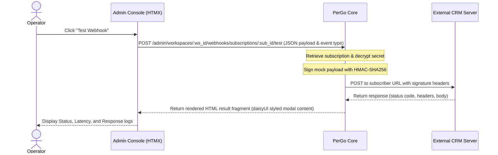

# Phase 17: Multi-Webhook Subscriptions - Research

This document outlines the research, architectural decisions, and blueprints required to implement **Phase 17: Multi-Webhook Subscriptions**. 

---

## 1. Proposed Database Schema Changes

To support multiple webhook subscriptions per workspace and link Dead-Letter Queue (DLQ) items to their originating subscription, we will migrate from the single-instance `webhook_configs` table to a new `webhook_subscriptions` table.

Below is the goose migration script:

```sql
-- +goose Up
-- Create the new webhook_subscriptions table
CREATE TABLE webhook_subscriptions (
    id UUID PRIMARY KEY DEFAULT gen_random_uuid(),
    workspace_id UUID NOT NULL REFERENCES workspaces(id) ON DELETE CASCADE,
    url TEXT NOT NULL,
    secret BYTEA NOT NULL,
    key_id TEXT NOT NULL,
    key_version INT NOT NULL DEFAULT 1,
    event_types TEXT[] NOT NULL,
    active BOOLEAN NOT NULL DEFAULT TRUE,
    created_at TIMESTAMPTZ NOT NULL DEFAULT now(),
    updated_at TIMESTAMPTZ NOT NULL DEFAULT now()
);

CREATE INDEX idx_webhook_subscriptions_workspace_id ON webhook_subscriptions(workspace_id);

-- Migrate existing configurations (assign catch-all '*' wildcard to maintain backwards compatibility)
INSERT INTO webhook_subscriptions (workspace_id, url, secret, key_id, key_version, event_types, active, created_at, updated_at)
SELECT workspace_id, url, secret, key_id, key_version, ARRAY['*'], TRUE, created_at, updated_at
FROM webhook_configs;

-- Add subscription_id column to webhook_dlqs
ALTER TABLE webhook_dlqs ADD COLUMN subscription_id UUID;

-- Associate existing DLQ logs with the migrated subscriptions based on workspace mapping
UPDATE webhook_dlqs d
SET subscription_id = s.id
FROM webhook_subscriptions s
WHERE d.workspace_id = s.workspace_id;

-- Purge orphan DLQ records where a configuration was deleted prior to migration
DELETE FROM webhook_dlqs WHERE subscription_id IS NULL;

-- Enforce constraints on subscription_id
ALTER TABLE webhook_dlqs ALTER COLUMN subscription_id SET NOT NULL;
ALTER TABLE webhook_dlqs ADD CONSTRAINT fk_webhook_dlqs_subscription_id 
    FOREIGN KEY (subscription_id) REFERENCES webhook_subscriptions(id) ON DELETE CASCADE;

-- Drop the legacy single-config table
DROP TABLE webhook_configs;

-- +goose Down
-- Recreate the legacy single-config table
CREATE TABLE webhook_configs (
    id UUID PRIMARY KEY DEFAULT gen_random_uuid(),
    workspace_id UUID NOT NULL REFERENCES workspaces(id) ON DELETE CASCADE,
    url TEXT NOT NULL,
    secret BYTEA NOT NULL,
    key_id TEXT NOT NULL,
    key_version INT NOT NULL DEFAULT 1,
    created_at TIMESTAMPTZ NOT NULL DEFAULT now(),
    updated_at TIMESTAMPTZ NOT NULL DEFAULT now(),
    UNIQUE (workspace_id)
);

CREATE INDEX idx_webhook_configs_workspace_id ON webhook_configs(workspace_id);

-- Restore legacy configs (take the first active or latest subscription per workspace)
INSERT INTO webhook_configs (workspace_id, url, secret, key_id, key_version, created_at, updated_at)
SELECT DISTINCT ON (workspace_id) workspace_id, url, secret, key_id, key_version, created_at, updated_at
FROM webhook_subscriptions
ORDER BY workspace_id, created_at DESC;

-- Remove foreign key constraint and column from DLQ
ALTER TABLE webhook_dlqs DROP CONSTRAINT fk_webhook_dlqs_subscription_id;
ALTER TABLE webhook_dlqs DROP COLUMN subscription_id;

-- Drop the subscriptions table
DROP TABLE webhook_subscriptions;
```

---

## 2. Database Access Methods

We will update the `internal/repository` package to define the access layer for subscriptions and refactor the DLQ repository.

### `internal/repository/webhook_subscription.go` (New Structure & Repository)

```go
package repository

import (
	"context"
	"errors"
	"time"

	"github.com/google/uuid"
	"github.com/jackc/pgx/v5"
	"github.com/jackc/pgx/v5/pgxpool"
)

var (
	ErrWebhookSubscriptionNotFound = errors.New("webhook subscription not found")
)

type WebhookSubscription struct {
	ID          uuid.UUID
	WorkspaceID uuid.UUID
	URL         string
	Secret      []byte // Plaintext secret decrypted by CredentialProvider
	KeyID       string
	KeyVersion  int
	EventTypes  []string
	Active      bool
	CreatedAt   time.Time
	UpdatedAt   time.Time
}

type WebhookSubscriptionRepository struct {
	pool      *pgxpool.Pool
	encryptor CredentialProvider
}

func NewWebhookSubscriptionRepository(pool *pgxpool.Pool, encryptor CredentialProvider) *WebhookSubscriptionRepository {
	return &WebhookSubscriptionRepository{
		pool:      pool,
		encryptor: encryptor,
	}
}

// Create inserts a new subscription
func (r *WebhookSubscriptionRepository) Create(ctx context.Context, wsID uuid.UUID, url string, eventTypes []string, secretPlaintext []byte) (*WebhookSubscription, error) {
	ciphertext, keyID, keyVersion, err := r.encryptor.Encrypt(secretPlaintext)
	if err != nil {
		return nil, err
	}

	var sub WebhookSubscription
	err = r.pool.QueryRow(ctx,
		`INSERT INTO webhook_subscriptions (workspace_id, url, secret, key_id, key_version, event_types, active, updated_at)
		 VALUES ($1, $2, $3, $4, $5, $6, TRUE, now())
		 RETURNING id, workspace_id, url, key_id, key_version, event_types, active, created_at, updated_at`,
		wsID, url, ciphertext, keyID, keyVersion, eventTypes,
	).Scan(&sub.ID, &sub.WorkspaceID, &sub.URL, &sub.KeyID, &sub.KeyVersion, &sub.EventTypes, &sub.Active, &sub.CreatedAt, &sub.UpdatedAt)
	if err != nil {
		return nil, err
	}
	sub.Secret = secretPlaintext
	return &sub, nil
}

// Get retrieves a subscription by ID
func (r *WebhookSubscriptionRepository) Get(ctx context.Context, id uuid.UUID) (*WebhookSubscription, error) {
	var sub WebhookSubscription
	var ciphertext []byte

	err := r.pool.QueryRow(ctx,
		`SELECT id, workspace_id, url, secret, key_id, key_version, event_types, active, created_at, updated_at
		 FROM webhook_subscriptions WHERE id = $1`,
		id,
	).Scan(&sub.ID, &sub.WorkspaceID, &sub.URL, &ciphertext, &sub.KeyID, &sub.KeyVersion, &sub.EventTypes, &sub.Active, &sub.CreatedAt, &sub.UpdatedAt)
	if err != nil {
		if errors.Is(err, pgx.ErrNoRows) {
			return nil, ErrWebhookSubscriptionNotFound
		}
		return nil, err
	}

	secret, err := r.encryptor.Decrypt(ciphertext)
	if err != nil {
		return nil, err
	}
	sub.Secret = secret
	return &sub, nil
}

// ListByWorkspace returns all subscriptions belonging to a workspace
func (r *WebhookSubscriptionRepository) ListByWorkspace(ctx context.Context, wsID uuid.UUID) ([]*WebhookSubscription, error) {
	rows, err := r.pool.Query(ctx,
		`SELECT id, workspace_id, url, secret, key_id, key_version, event_types, active, created_at, updated_at
		 FROM webhook_subscriptions WHERE workspace_id = $1 ORDER BY created_at DESC`,
		wsID,
	)
	if err != nil {
		return nil, err
	}
	defer rows.Close()

	var subs []*WebhookSubscription
	for rows.Next() {
		var sub WebhookSubscription
		var ciphertext []byte
		err := rows.Scan(&sub.ID, &sub.WorkspaceID, &sub.URL, &ciphertext, &sub.KeyID, &sub.KeyVersion, &sub.EventTypes, &sub.Active, &sub.CreatedAt, &sub.UpdatedAt)
		if err != nil {
			return nil, err
		}
		secret, err := r.encryptor.Decrypt(ciphertext)
		if err != nil {
			return nil, err
		}
		sub.Secret = secret
		subs = append(subs, &sub)
	}
	return subs, nil
}

// Update modifies a subscription
func (r *WebhookSubscriptionRepository) Update(ctx context.Context, id uuid.UUID, url string, eventTypes []string, active bool, secretPlaintext []byte) error {
	var err error
	if len(secretPlaintext) > 0 {
		ciphertext, keyID, keyVersion, err := r.encryptor.Encrypt(secretPlaintext)
		if err != nil {
			return err
		}
		_, err = r.pool.Exec(ctx,
			`UPDATE webhook_subscriptions 
			 SET url = $1, event_types = $2, active = $3, secret = $4, key_id = $5, key_version = $6, updated_at = now()
			 WHERE id = $7`,
			url, eventTypes, active, ciphertext, keyID, keyVersion, id,
		)
	} else {
		_, err = r.pool.Exec(ctx,
			`UPDATE webhook_subscriptions 
			 SET url = $1, event_types = $2, active = $3, updated_at = now()
			 WHERE id = $4`,
			url, eventTypes, active, id,
		)
	}
	return err
}

// Delete removes a subscription
func (r *WebhookSubscriptionRepository) Delete(ctx context.Context, id uuid.UUID) error {
	_, err := r.pool.Exec(ctx, "DELETE FROM webhook_subscriptions WHERE id = $1", id)
	return err
}
```

---

## 3. NATS JetStream Stream/Consumer Configurations and Delivery Routing

### Stream Separation to Prevent Overlaps

NATS JetStream does not permit streams with overlapping subjects. We must update the `WEBHOOKS` stream subject definition to isolate it from the new delivery subjects:

*   **Raw Webhook Events Stream (`WEBHOOKS`):**
    *   **Subjects:** `[]string{"webhooks.events"}`
    *   **Retention:** `LimitsPolicy` (durable storage for initial event capture).
*   **Decoupled Delivery Stream (`WEBHOOK_DELIVERIES`):**
    *   **Subjects:** `[]string{"webhooks.deliveries.>"}`
    *   **Retention:** `WorkQueuePolicy` (messages are pruned upon completion).
    *   **Discard:** `DiscardNew` (propagates backpressure if queue hits safety depth).
    *   **MaxMsgs:** `10000`

### NATS Subjects Layout

*   **Ingested Raw Events:**
    *   Outbound: `webhooks.events`
    *   Inbound: `inbound.events.<workspace_id>`
*   **Decoupled Dispatch Deliveries:**
    *   Subject pattern: `webhooks.deliveries.<workspace_id>.<subscription_id>`

### Delivery Consumer Setup

We will configure a durable pull consumer on `WEBHOOK_DELIVERIES`:

```go
// EnsureWebhookDeliveryStream creates or updates the WEBHOOK_DELIVERIES stream.
func EnsureWebhookDeliveryStream(ctx context.Context, nc *nats.Conn) (jetstream.Stream, error) {
	js, err := jetstream.New(nc)
	if err != nil {
		return nil, err
	}
	return js.CreateOrUpdateStream(ctx, jetstream.StreamConfig{
		Name:      "WEBHOOK_DELIVERIES",
		Subjects:  []string{"webhooks.deliveries.>"},
		Retention: jetstream.WorkQueuePolicy,
		MaxMsgs:   10000,
		Discard:   jetstream.DiscardNew,
		Storage:   jetstream.FileStorage,
		MaxAge:    24 * time.Hour,
	})
}
```

---

## 4. Go Structures and Handlers for Webhook Dispatching & Retries

### Routing & Wildcard Matching

We will employ Go's `path.Match` to filter events in memory. This aligns matching logic with globbing standards:

```go
package webhook

import (
	"path"
)

// MatchEvent matches an incoming event (e.g. "message.received") against a pattern (e.g. "message.*" or "*").
func MatchEvent(pattern, eventName string) bool {
	if pattern == "*" {
		return true
	}
	matched, err := path.Match(pattern, eventName)
	if err != nil {
		return pattern == eventName // Fallback to exact match
	}
	return matched
}

// MatchesAny returns true if the eventName matches any of the patterns.
func MatchesAny(patterns []string, eventName string) bool {
	for _, pattern := range patterns {
		if MatchEvent(pattern, eventName) {
			return true
		}
	}
	return false
}
```

### Fan-out Payload Structure

```go
type WebhookDeliveryTask struct {
	ID             uuid.UUID       `json:"id"`
	SubscriptionID uuid.UUID       `json:"subscription_id"`
	WorkspaceID    uuid.UUID       `json:"workspace_id"`
	Event          string          `json:"event"`
	TraceID        string          `json:"trace_id"`
	MessageID      string          `json:"message_id"`
	Payload        []byte          `json:"payload"`
	Mode           string          `json:"mode"` // "inbound" | "outbound"
}
```

### Decoupled Worker Flow (Fan-out Phase)

Upon consuming a raw event from `webhooks.events` or `inbound.events.>`:
1. Parse `workspace_id` and `event` from the envelope.
2. Query `webhook_subscriptions` for all active records belonging to the workspace.
3. Filter subscriptions in-memory using `MatchesAny(sub.EventTypes, event)`.
4. For each matching subscription, publish a `WebhookDeliveryTask` to `webhooks.deliveries.<workspace_id>.<subscription_id>`.
5. Ack the raw event.

### Delivery execution & Backoff Flow (Execution Phase)

A pool of worker goroutines consumes from the `webhooks.deliveries.>` subject:
1. Fetch the corresponding subscription details from the database. If the subscription is inactive or deleted, Ack to prune the task.
2. Fetch Workspace options to check for PII compliance. If `PIIOptIn` is false and `mode == "inbound"`, redact PII (hash `from`, strip `location` and `contacts`).
3. Build the HTTP request:
    *   Sign the payload: `X-PerGo-Signature` using `SignPayload` with the decrypted subscription secret.
    *   Propagate trace header: `X-Trace-ID`.
4. Fire the HTTP POST.
5. If the request returns a **2xx status code**, Ack.
6. If the request fails (non-2xx code or connection error):
    *   Determine if the error is terminal (HTTP statuses: `400`, `401`, `403`, `404`).
    *   Extract the attempt count using `msg.Metadata().NumDelivered`.
    *   If **attempts >= 10** or the error is **terminal**:
        *   Log failure and insert records into `webhook_dlqs` mapping it to the specific `subscription_id`.
        *   Ack the task.
    *   Else:
        *   Calculate exponential backoff: `delay := 2^(attempts-1) * time.Second` (capped at 10 minutes).
        *   Call `msg.NakWithDelay(delay)`.

---

## 5. HTML Templates Updates for Multiple Webhooks Layout

We will use Tailwind and DaisyUI components to allow managing multiple subscriptions in a single dashboard screen:

```
+--------------------------------------------------------------------------------+
|  Workspace Settings: Webhooks                                                 |
+--------------------------------------------------------------------------------+
|                                                              [+ Add Endpoint]  |
|                                                                                |
|  Active Subscriptions                                                          |
|  +--------------------------------------------------------------------------+  |
|  | URL                              | Events         | Status   | Actions   |  |
|  +-----------------------------------+----------------+----------+-----------+  |
|  | https://api.crm.com/inbound       | message.rcvd   | [Active] | [Edit]    |  |
|  |                                   |                |          | [Delete]  |  |
|  |                                   |                |          | [Test]    |  |
|  +-----------------------------------+----------------+----------+-----------+  |
|  | https://api.crm.com/all-activity  | *              | [Active] | [Edit]    |  |
|  |                                   |                |          | [Delete]  |  |
|  |                                   |                |          | [Test]    |  |
|  +-----------------------------------+----------------+----------+-----------+  |
|                                                                                |
|  Dead-Letter Queue (DLQ)                                                       |
|  +--------------------------------------------------------------------------+  |
|  | Trace ID   | Endpoint URL                | Event        | Attempts | Act |  |
|  +------------+-----------------------------+--------------+----------+-----+  |
|  | tr-9201    | https://api.crm.com/inbound | message.rcvd | 10       | [R] |  |
|  +------------+-----------------------------+--------------+----------+-----+  |
+--------------------------------------------------------------------------------+
```

### Key UI Features
*   **Badges for Event Filtering**: Display event types as individual badge components.
*   **Creation & Edit Form Accordion/Modal**: Allow checking specific boxes for event types:
    *   `[ ] All Events (*)`
    *   `[ ] message.received`
    *   `[ ] message.sent`
    *   `[ ] message.failed`
    *   `[ ] connection.status`
*   **Simulate Modal**: Allows developers to pick an event payload, send it synchronously to their server, and see the exact response headers and body response inline.

---

## 6. Simulation/Testing Execution Path Design

To optimize visual feedback and support operators debugging signature checks and parsing payload headers, the **"Test Webhook"** simulation will run **synchronously**:



### Execution Details:
*   **Routing**: `POST /admin/workspaces/:workspace_id/webhooks/subscriptions/:subscription_id/test`
*   **Mock payload selection**: Provide pre-populated mock templates depending on the event selection.
*   **Signature computation**: Signs the payload using the decrypted signing secret with standard HMAC-SHA256, mapping production headers.
*   **Visual Output**: Shows status code, execution latency (e.g. `210ms`), response headers, and the response body (capped to first 1000 characters).

---

## What do I need to know to PLAN this phase well?

1. **NATS Stream Subject Overlaps**: We must update `WEBHOOKS` stream configuration (`webhooks.>`) before adding `WEBHOOK_DELIVERIES` stream (`webhooks.deliveries.>`), or NATS will throw an overlap error.
2. **Wildcard Glob Standard**: Go's standard library `path.Match` uses `/` as a delimiter. Because webhook events contain dot separators (e.g., `message.received`), wildcard globbing via `path.Match` works perfectly because dots are matched by the wildcard `*`.
3. **Migrating DB Schema**: We must write a migration that creates `webhook_subscriptions`, migrates existing configs with a default `*` event types text array, maps existing DLQ items, and deletes the `webhook_configs` table without losing data.
4. **Synchronous Testing Path**: Running the webhook test simulation synchronously is cleaner and vastly improves user debugging compared to asynchronous NATS queueing.
