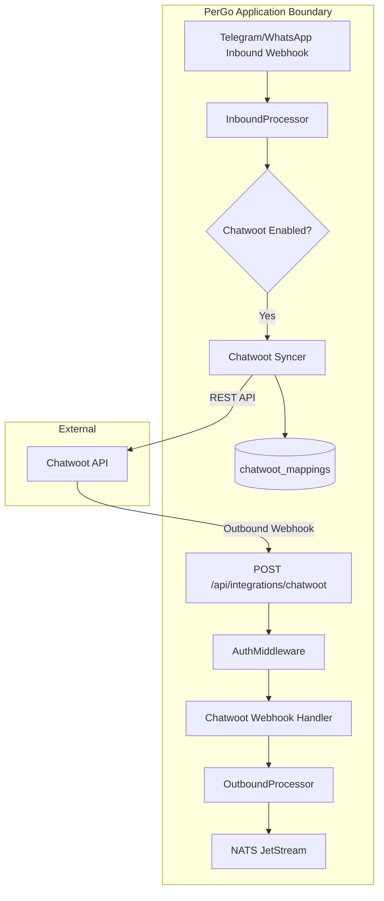

# Phase 21: Chatwoot Integration - Research

**Researched:** 2026-07-17
**Domain:** External Integration Sync / Chatwoot API
**Confidence:** HIGH

## Summary

This phase implements bidirectional integration between PerGo and Chatwoot, enabling human agents to interact with customers across all configured messaging channels (WABA, Telegram, WhatsApp Web). 

Inbound synchronization (Customer -> PerGo -> Chatwoot) dynamically resolves or registers contacts and conversations in Chatwoot, updating local mapping entries. Outbound synchronization (Agent -> Chatwoot -> PerGo -> Customer) validates inbound webhooks from Chatwoot, looks up target channels, and enqueues messages to NATS JetStream for delivery.

**Primary recommendation:** Use PerGo's contact UUID as Chatwoot's contact `identifier` to guarantee idempotent lookup, and update mapping metadata dynamically on inbound traffic to support seamless channel handoffs.

## Architectural Responsibility Map

| Capability | Primary Tier | Secondary Tier | Rationale |
|------------|-------------|----------------|-----------|
| **Integration Config Management** | Admin Tier | Postgres | Unified `integrations` table with AES-256-GCM encrypted config envelope using the `CredentialProvider` interface `[VERIFIED: codebase]`. |
| **Inbound Webhook Authentication** | Ingest Tier | API Key Middleware | Reuses `AuthMiddleware` query parameter token checks on public Echo handlers `[VERIFIED: codebase]`. |
| **Contact & Conversation Mapping** | Postgres | Integration Repo | A local `chatwoot_mappings` table correlates customer ID with Chatwoot endpoints to avoid expensive lookup API calls on every message. |
| **Outbound Ingestion & Dispatch** | Outbound Processor | NATS JetStream | Webhook-received replies are parsed, validated, and pushed directly to `messages.outbound` `[VERIFIED: codebase]`. |
| **Customer Message Sync** | Inbound Processor | Chatwoot API Client | Intercepts inbound events post-resolution, posting messages to active Chatwoot conversations. |

## Standard Stack

### Core
| Library | Version | Purpose | Why Standard |
|---------|---------|---------|--------------|
| `net/http` | Go 1.26.4 | REST API interaction with Chatwoot | Standard library, zero-dependency, safe from supply-chain vulnerabilities `[VERIFIED: go.mod]`. |
| `encoding/json` | Go 1.26.4 | Serializing configuration and payloads | Built-in, high-performance, robust serialization helper. |

### Supporting
| Library | Version | Purpose | When to Use |
|---------|---------|---------|-------------|
| `github.com/labstack/echo/v5` | v5.2.1 | API routing & webhook handling | Web framework already wired in the application `[VERIFIED: go.mod]`. |
| `github.com/jackc/pgx/v5` | v5.10.0 | Database query execution | Existing database driver pool wrapper `[VERIFIED: go.mod]`. |

### Alternatives Considered
| Instead of | Could Use | Tradeoff |
|------------|-----------|----------|
| Custom Client | Go Chatwoot SDK | Custom HTTP client reduces dependency bloat, handles token refresh and custom mapping scenarios more transparently. |

**Installation:**
No new external Go packages are required. Existing dependencies are sufficient.

## Package Legitimacy Audit

No new external packages are introduced in this phase. Existing dependencies are already audited.

## Architecture Patterns

### System Architecture Diagram


### Recommended Project Structure
```
internal/
├── repository/
│   ├── integration.go            # CRUD for the integrations table
│   └── chatwoot_mapping.go       # CRUD for chatwoot_mappings table
├── integration/
│   └── chatwoot/
│       ├── client.go             # Chatwoot REST client
│       └── syncer.go             # Inbound sync coordinator
├── api/
│   ├── handler/
│   │   ├── chatwoot_webhook.go   # Inbound webhook from Chatwoot
│   │   └── admin/
│   │       └── integration.go    # Admin configuration endpoint
```

### Pattern 1: Last-Active Routing Pattern
To support dynamic channel handoff (e.g., when a customer switches from Telegram to WhatsApp), update the mapped channel fields on every incoming customer message.
```go
// Pattern for updating mapping status dynamically
func (r *MappingRepository) Upsert(ctx context.Context, m *ChatwootMapping) error {
    _, err := r.pool.Exec(ctx, `
        INSERT INTO chatwoot_mappings (workspace_id, contact_id, chatwoot_contact_id, chatwoot_conversation_id, channel, sender_identity)
        VALUES ($1, $2, $3, $4, $5, $6)
        ON CONFLICT (workspace_id, contact_id) 
        DO UPDATE SET channel = EXCLUDED.channel, sender_identity = EXCLUDED.sender_identity, updated_at = NOW()
    `, m.WorkspaceID, m.ContactID, m.ChatwootContactID, m.ChatwootConversationID, m.Channel, m.SenderIdentity)
    return err
}
```

### Anti-Patterns to Avoid
- **Hardcoded API Secrets in Database**: Avoid saving tokens in plaintext. Always use `CredentialProvider` to envelop-encrypt credentials inside `integrations.config` column `[VERIFIED: codebase]`.
- **API Lookups on Every Inbound Webhook**: Performing search API calls to Chatwoot on every customer message will quickly exceed API rate limits. Rely on `chatwoot_mappings` table mappings first.

## Don't Hand-Roll

| Problem | Don't Build | Use Instead | Why |
|---------|-------------|-------------|-----|
| Credential Storage Encryption | Custom AES helper functions | `crypto.Encryptor` | Reuses verified KEK/DEK envelope crypto logic `[VERIFIED: codebase]`. |
| Webhook Key Authorization | Custom token comparison logic | `AuthMiddleware` | Validates API tokens using database hashes and sets tenant context `[VERIFIED: codebase]`. |

## Common Pitfalls

### Pitfall 1: Loop and Echo Backfire
* **What goes wrong:** PerGo forwards customer message to Chatwoot; Chatwoot fires `"message_created"` event; PerGo processes and enqueues to NATS, causing redundant delivery.
* **Why it happens:** The webhook doesn't distinguish customer inbound sync from agent replies.
* **How to avoid:** Filter webhook payloads strictly: only process `message_type == "outgoing"`, `private == false`, and `sender.type == "user"` `[VERIFIED: 21-CONTEXT.md]`.

## Code Examples

### Chatwoot Outgoing Message Payload Validation
```go
// Source: [CITED: www.chatwoot.com/docs/api]
type ChatwootWebhookPayload struct {
	Event       string `json:"event"`
	MessageType string `json:"message_type"` // Must be "outgoing"
	Private     bool   `json:"private"`      // Must be false
	Content     string `json:"content"`
	Sender      struct {
		Type string `json:"sender_type"` // Must be "user"
	} `json:"sender"`
	Conversation struct {
		ID      int64 `json:"id"`
		InboxID int64 `json:"inbox_id"`
	} `json:"conversation"`
}
```

## State of the Art
| Old Approach | Current Approach | When Changed | Impact |
|--------------|------------------|--------------|--------|
| Dedicated `chatwoot_configs` table per channel | Unified `integrations` table with encrypted JSON envelope config | Phase 21 Context | Clean database schema, zero schema migration overhead for future extensions `[VERIFIED: 21-CONTEXT.md]`. |

## Assumptions Log
| # | Claim | Section | Risk if Wrong |
|---|-------|---------|---------------|
| A1 | Chatwoot searches contacts successfully by `identifier` UUID parameter. | Outbound Ingestion | Search may fall back to phone/email matching, causing sync bugs. `[ASSUMED]` |
| A2 | Chatwoot webhook payloads structure matches the public v1 schema under self-hosted instances. | Webhook Inbound | JSON mapping mismatch could discard outgoing human agent replies. `[ASSUMED]` |

## Open Questions
1. **Attachment Synchronization**: Should customer media files (images, audios) be posted as attachments using multipart-form data, or is passing the S3 URL in message text sufficient?
   - *Recommendation*: Start by passing S3 URLs in text blocks to keep API client simple, then upgrade to multipart file upload where supported.

## Environment Availability
* External Chatwoot Server is required.
* Sandbox environment: Mocked locally during tests using standard Go `httptest.NewServer` pipelines.

## Validation Architecture

### Test Framework
| Property | Value |
|----------|-------|
| Framework | Go `testing` toolchain |
| Config file | None |
| Quick run command | `go test ./internal/repository/...` |
| Full suite command | `go test ./...` |

### Phase Requirements → Test Map
| Req ID | Behavior | Test Type | Automated Command | File Exists? |
|--------|----------|-----------|-------------------|-------------|
| CHAT-01 | Create and decrypt integrations settings | Repository Unit Test | `go test -run TestIntegrationRepository ./internal/repository` | No |
| CHAT-02 | Webhook endpoint accepts authenticated requests | Integration test | `go test -run TestChatwootWebhookHandler ./internal/api/handler` | No |
| CHAT-03 | Incoming webhook parses human replies and publishes to NATS | System test | `go test -run TestChatwootIngressPipeline ./internal/api/handler` | No |
| CHAT-04 | Sync incoming message to Chatwoot API | Client Integration test | `go test -run TestChatwootSync ./internal/integration/chatwoot` | No |

## Security Domain

### Applicable ASVS Categories
| ASVS Category | Applies | Standard Control |
|---------------|---------|-----------------|
| **V1.2 Authentication** | Yes | Webhooks must require unique validation keys (`?token=`). |
| **V8.3 Data Protection** | Yes | Integrations config persisted to DB must be encrypted at rest using AES-256-GCM. |
| **V11.1 Business Logic** | Yes | Guard against loops and check message permissions (`private == false`). |

### Known Threat Patterns for Go/Postgres/Chatwoot
| Pattern | STRIDE | Standard Mitigation |
|---------|--------|---------------------|
| Webhook Spoofing | Spoofing | Reject requests lacking valid query param `token` signatures. |
| Credentials Exposure | Information Disclosure | Store credentials inside a `config` column with envelope cryptography. |
| Infinite Echo Loop | Business Logic Error | Drop webhooks where `sender_type != "user"`. |

## Sources
### Primary (HIGH confidence)
* `internal/platform/crypto/encrypt.go` `[VERIFIED: codebase]`
* `internal/api/middleware/auth.go` `[VERIFIED: codebase]`
* `.planning/phases/21-chatwoot-integration/21-CONTEXT.md` `[VERIFIED: codebase]`

### Secondary (MEDIUM confidence)
* Chatwoot Public REST API v1 Documentation `[CITED: www.chatwoot.com/docs/api]`

## Metadata
**Confidence breakdown:**
- Code reuse capability: HIGH (already verified in-code components)
- External API schema alignment: MEDIUM (relies on standard Chatwoot docs, custom fields may vary)

**Research date:** 2026-07-17
**Valid until:** 2027-07-17
