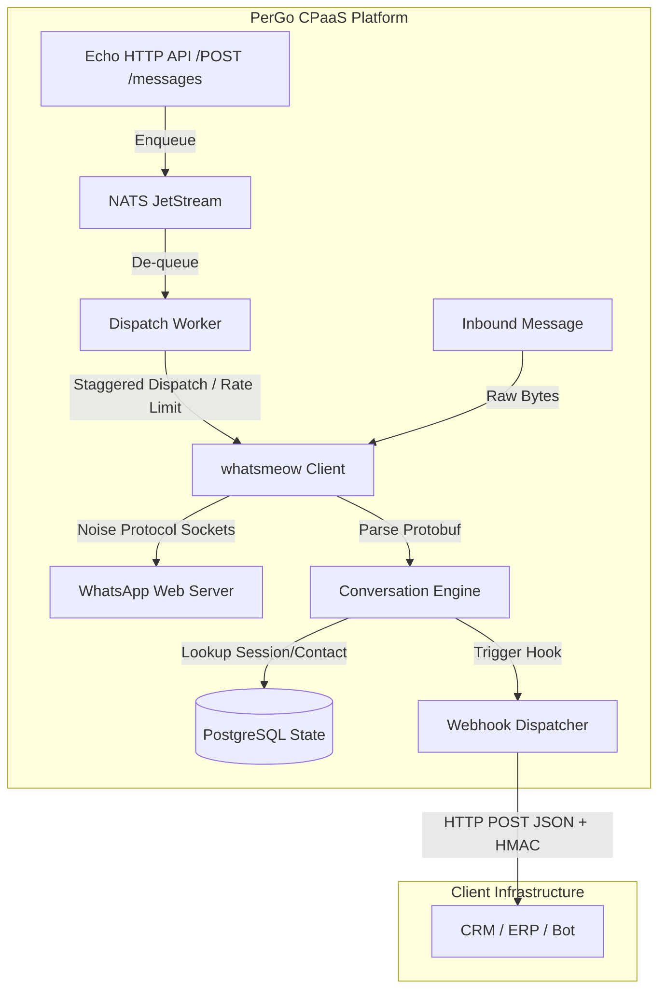
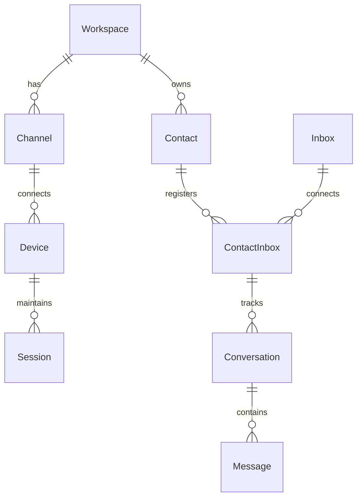

# Open-Source Twilio Alternatives & Bidirectional Messaging Systems

This document explores mature open-source alternatives to Twilio CPaaS, with a focus on **two-way messaging exchange** (bidirectional chat, session management, inbound webhooks, and outbound dispatch APIs) rather than simple one-way notification alerts.

---

## 1. Comparative Analysis Matrix

| Platform | Core Focus | Maturity Level | Primary Tech Stack | Queue / Broker | State/Session Management Model |
| :--- | :--- | :--- | :--- | :--- | :--- |
| **Fonoster** | Programmable Voice & SIP | Moderate (Telephony-first) | Node.js, PostgreSQL (Prisma), gRPC, Routr | N/A (Direct gRPC/SIP) | Verbs-based voice control (TwiML-like). Lacks native persistent chat sessions. |
| **Chatwoot** | Omnichannel Customer Engagement | Very High (Enterprise-grade) | Ruby on Rails, PostgreSQL, Redis, Vue.js | Sidekiq | Structured DB entities (`Inbox` -> `Contact` -> `ContactInbox` -> `Conversation`). Real-time dashboard updates via ActionCable (WebSockets). |
| **Evolution API** | Unofficial WhatsApp API Gateway | High (Production-ready) | Node.js, Prisma, PostgreSQL/MySQL, Redis | RabbitMQ, SQS, or Redis | Isolated WhatsApp client instances (via Baileys protocol wrapper). Connection state cached in Redis. Event webhooks (`messages.upsert`). |
| **WPPConnect** | WhatsApp Web Browser Automation | Moderate | Node.js, Express, Puppeteer/Playwright | Redis / BullMQ / RabbitMQ | Spawns a full headless browser instance per WhatsApp session. Event-driven REST & webhooks. Very resource-heavy. |
| **Jambonz** | Voice-first CPaaS & LLM Orchestration | High (Telephony-first) | Node.js, drachtio SIP, FreeSWITCH, MySQL, Redis | N/A (Redis / Call Queues) | Webhook and WebSocket call routing (JSON verbs like `answer`, `gather`, `dial`). |
| **Novu** | Developer Notification Engine | High | Node.js (NestJS), MongoDB, Redis, React | BullMQ (Redis) | One-way notification workflows (alerting/dispatching). No two-way conversation session state. |

---

## 2. Detailed Candidate Profiles

### Fonoster

*   **Core Focus & Maturity:** 
    Fonoster is promoted as "the open-source alternative to Twilio." However, its architecture is almost entirely biased toward **Voice and SIP telephony** (IVR systems, WebRTC, and call routing). It is not designed to serve as a high-performance, two-way messaging gateway.
*   **Tech Stack & Architecture:**
    *   **Languages:** Node.js / TypeScript.
    *   **Databases:** PostgreSQL (via Prisma ORM) for resource configurations (domains, agents, numbers).
    *   **Internal Routing:** Exposes **gRPC** interfaces for internal microservice communication and uses **Routr** (a cloud-native SIP proxy/registrar) for SIP signaling.
*   **Bidirectional Session Management:**
    *   Voice flows are managed via a declarative API using a series of commands/verbs (e.g., `Say`, `Gather`, `Play`, `Dial`) similar to Twilio's TwiML.
    *   It does not maintain persistent conversational states for chat. Messages (SMS) are dispatched as simple one-off HTTP requests to connected SIP trunks or SMS gateways, without a stateful session layer.
*   **Key Takeaways for PerGo:**
    *   *Microservices & gRPC:* High-performance internal services using gRPC can keep internal processing overhead low.
    *   *Verbs Protocol:* A simple, declarative JSON vocabulary can simplify how external developers instruct the gateway to perform actions (e.g., scheduling staggered dispatches).

### Chatwoot

*   **Core Focus & Maturity:**
    An extremely mature, production-grade omnichannel customer engagement engine. It is designed to aggregate messages from diverse channels into a unified conversational inbox for agents.
*   **Tech Stack & Architecture:**
    *   **Backend:** Ruby on Rails.
    *   **Database:** PostgreSQL (primary datastore for logs, contacts, and configuration).
    *   **Queue/Broker:** **Sidekiq** backed by **Redis** for asynchronous processing.
    *   **Real-time Layer:** **ActionCable** (Rails' WebSocket framework) to push live updates to the Vue.js frontend dashboard.
*   **Bidirectional Session Management:**
    Chatwoot has the most robust logical database-driven session management of all candidates:
    *   **Channel:** Interface mapping (e.g., WhatsApp Cloud, Telegram, Twilio SMS).
    *   **Inbox:** A specific instance of a channel (e.g., a specific WhatsApp phone number).
    *   **Contact:** The unified database representation of a customer (phone, email, custom metadata).
    *   **ContactInbox:** The routing bridge containing the unique channel identifier (e.g., phone number for WhatsApp, email address, or web session hash).
    *   **Conversation (Session):** Belongs to both a Contact and an Inbox. Tracks conversation lifecycles via states (`open`, `resolved`, `pending`, `snoozed`).
    *   When an inbound webhook fires, Chatwoot extracts the sender's identifier, performs a lookup on `ContactInbox`, retrieves or creates the `Contact`, finds the active `Conversation` (or spawns a new one if the previous is resolved), and appends the incoming message.
*   **Key Takeaways for PerGo:**
    *   *Domain Modeling:* The `Channel` -> `Inbox` -> `Contact` -> `ContactInbox` -> `Conversation` structure is the gold standard for multi-tenant, omnichannel communication systems.
    *   *Webhook Security:* Chatwoot signs webhooks using **HMAC-SHA256** signatures (`X-Chatwoot-Signature` header). PerGo must implement webhook signing to ensure target CRM applications can verify payload authenticity.
    *   *State-Aware Routing:* Decoupling raw connection ports from logical conversation sessions allows systems to route messages seamlessly even if connection tokens or hardware sessions expire.

### Evolution API

*   **Core Focus & Maturity:**
    A highly mature, event-driven RESTful middleware designed specifically to act as an API gateway for WhatsApp. It allows developers to deploy multi-instance connection gates to bridge legacy channels into modern web frameworks.
*   **Tech Stack & Architecture:**
    *   **Runtime:** Node.js.
    *   **Database:** PostgreSQL/MySQL (via Prisma ORM) to persist contact lists, message histories, and instance configurations.
    *   **Queuing:** Out-of-the-box support for **RabbitMQ**, **Amazon SQS**, or **Redis** to queue tasks and event dispatches, preventing connection timeouts.
    *   **WebSocket/Webhook:** Real-time event streaming (`messages.upsert`, connection status updates) to external services.
*   **Bidirectional Session Management:**
    *   Maintains persistent, stateful client connections to WhatsApp Web via **Baileys** (a socket-based protocol wrapper).
    *   **Instance Isolation:** Each WhatsApp connection runs in an isolated runtime environment with its own unique API key.
    *   **Redis Caching:** Session state (tokens, QR session keys) is cached in Redis so that connections survive API restarts without requiring a new QR scan.
    *   **State Control:** It allows users to selectively toggle data saving settings (e.g., `DATABASE_SAVE_DATA_NEW_MESSAGE` = true/false), minimizing database growth in high-throughput environments.
*   **Key Takeaways for PerGo:**
    *   *Queue-Decoupled Workers:* Outbound dispatches and inbound webhook notifications should be separated from HTTP request-response cycles. PerGo's architectural choice of **NATS JetStream** mirrors Evolution API's RabbitMQ integration to ensure backpressure control.
    *   *Selective Data Saving:* Giving operators the choice to turn off database logging for raw message contents (preserving only metadata for audits) keeps database scaling manageable.
    *   *Session Persistence:* Caching device and session keys in PostgreSQL (`whatsmeow_device` table) allows PerGo to rebuild client state seamlessly across application restarts.

### WPPConnect / WPPConnect Server

*   **Core Focus & Maturity:**
    WPPConnect is an open-source WhatsApp Web automation framework. It wraps the WhatsApp Web application in a headless browser to expose automated functionalities.
*   **Tech Stack & Architecture:**
    *   **Runtime:** Node.js with Express.
    *   **Orchestrator:** **Puppeteer** or **Playwright** (driving headless Chromium).
    *   **Broker/Queue:** Redis / RabbitMQ / BullMQ.
    *   **Real-time:** Socket.io.
*   **Bidirectional Session Management:**
    *   Each WhatsApp account session spawns a complete headless Chromium browser page.
    *   Keeps session details (local storage, cookies) inside mapped Docker volumes.
*   **Key Takeaways for PerGo (Cautionary Tale):**
    *   *High Overhead:* WPPConnect serves as a critical warning. Running a headless browser per connection consumes **150–250MB RAM** minimum. Scaling to dozens of workspaces/numbers becomes highly expensive.
    *   *Brittle Maintainability:* Puppeteer-based wrappers are highly susceptible to breakages when WhatsApp Web updates its HTML/React DOM structure.
    *   *Protocol-Level Dominance:* PerGo's choice of **whatsmeow** (a socket-level protocol wrapper parsing protobufs directly) is far superior. It achieves the performance targets (>= 500 msg/sec, < 512MB RAM) by bypassing headless browser virtualization entirely.

---

## 3. Reference Architecture Comparison

### PerGo Conceptual Architecture (incorporating takeaways)

The diagram below outlines how PerGo can combine the developer-first gateway model of **Evolution API** with the clean multi-channel domain abstractions of **Chatwoot** using high-performance Go components (**NATS JetStream** & **whatsmeow**):

### Domain Entity Modeling Reference

For stateful bidirectional routing, PerGo can reference the following clean database schema relationships:

---

## 4. Key Recommendations for PerGo

1.  **Adopt a Clean Session/Contact Mapping Layer (Chatwoot):**
    To successfully implement two-way conversations, PerGo needs to map inbound messages to logical conversational sessions rather than simply routing raw webhook payloads. Introduce a `contacts` table and a `conversations` (or `sessions`) table. Use the incoming phone number or account ID as the routing key to link the message to an active conversation session.
2.  **Rely on Protocol-level Bridges (Evolution API vs WPPConnect):**
    Double-down on the choice of **whatsmeow** over Puppeteer/Playwright. Browser automation is too slow and resource-heavy to hit PerGo's target of 500 messages/sec under 512MB of RAM.
3.  **Implement Webhook Event Decoupling & Queueing (Evolution API):**
    Inbound messages from WhatsApp Web should be immediately written to NATS JetStream and processed asynchronously. Do not trigger webhooks to the customer CRM synchronously inside the whatsmeow socket event loop; a failure or slow response from the CRM would block the socket listener.
4.  **Enforce Webhook Security via HMAC signatures:**
    Add custom signature verification. Calculate an HMAC-SHA256 signature of the webhook payload using a secret key configured per workspace, and send it via an `X-PerGo-Signature` header so the receiving application can authenticate the request.
