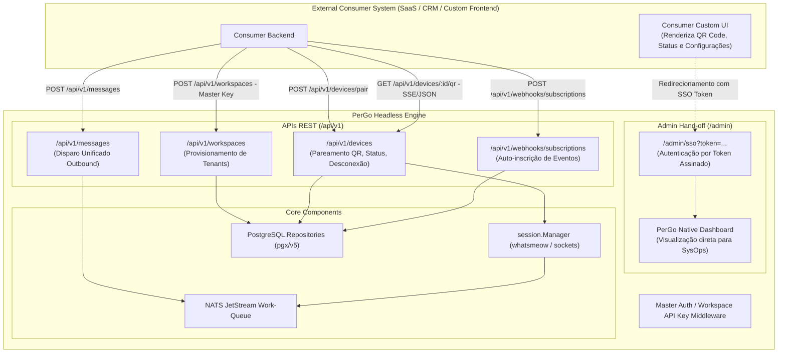
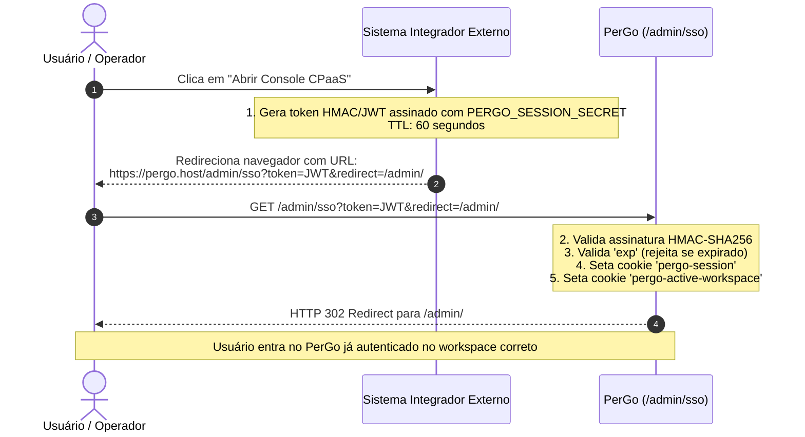
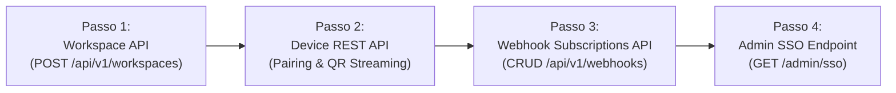

# PerGo Headless CPaaS & Integration APIs Specification
**Document Type:** RFC / Architectural Roadmap & Technical Specification  
**Target Repository:** `PerGo` (Omnichannel Communications Platform as a Service)  
**Status:** Approved for Implementation  

---

## 1. Visão Geral e Motivação

O **PerGo** é uma plataforma CPaaS (Communications Platform as a Service) self-hosted e open-source desenvolvida em Go. Atualmente, o PerGo possui uma API unificada de mensageria (`POST /api/v1/messages`) e um console administrativo server-rendered (`/admin/*`) baseado em `a-h/templ` e HTMX.

Para atender a cenários onde sistemas externos (CRMs, ERPs, plataformas SaaS, orquestradores de IA ou ferramentas de atendimento) necessitam embutir a mensageria de forma **100% headless** (sem redirecionar o usuário final para a interface do PerGo), o PerGo precisa evoluir suas capacidades de backend, expondo via **REST API padronizada (`/api/v1/`)** todas as operações que hoje são exclusivas da interface administrativa.

Adicionalmente, para permitir que operadores avançados desses sistemas externos transitem para o painel administrativo nativo do PerGo quando necessário, deve ser implementado um mecanismo seguro e desacoplado de **Single Sign-On (SSO) / Seamless Hand-off**.

---

## 2. Diagrama de Arquitetura Headless



---

## 3. Especificação Detalhada dos Novos Módulos

### 3.1 Módulo 1: Provisionamento Programático de Workspaces
Permite que sistemas externos criem e configurem tenants (workspaces) de forma automatizada.

* **Autenticação:** Header `Authorization: Bearer <PERGO_MASTER_KEY>` ou chave mestre de provisionamento configurada via variável de ambiente (`PERGO_MASTER_KEY` / `PERGO_ADMIN_PASSWORD`).
* **Endpoint:** `POST /api/v1/workspaces`

#### Request:
```json
{
  "name": "Cliente Acme Corp",
  "generate_api_key": true,
  "generate_webhook_secret": true
}
```

#### Response (`HTTP 201 Created`):
```json
{
  "id": "a5e8c1b2-3f4d-4e5a-8b9c-0d1e2f3a4b5c",
  "name": "Cliente Acme Corp",
  "api_key": "pgo_live_8f3d1b9a7c2e4f0a1b2c3d4e5f6a7b8c",
  "webhook_secret": "whsec_9a8b7c6d5e4f3a2b1c0d9e8f7a6b5c4d",
  "created_at": "2026-08-14T18:00:00Z"
}
```

---

### 3.2 Módulo 2: Lifecycle e Pareamento Headless de Conexões (`/api/v1/devices`)
Permite iniciar sessões do WhatsApp Web (whatsmeow), obter QR Code para renderização remota, monitorar conectividade e conectar instâncias WABA/Telegram.

#### 1. Iniciar Pareamento WhatsApp Web
* **Endpoint:** `POST /api/v1/devices/pair` (ou `POST /api/v1/workspaces/:workspace_id/devices/pair`)
* **Autenticação:** `Bearer <workspace_api_key>`

##### Request:
```json
{
  "channel": "whatsapp",
  "phone": "5511999999999",
  "name": "WhatsApp Atendimento 01",
  "proxy_url": ""
}
```

##### Response (`HTTP 200 OK`):
```json
{
  "connection_id": "7b1c3d5e-9f8a-4b2c-8d1e-0a2b3c4d5e6f",
  "phone": "5511999999999",
  "status": "pairing_started",
  "message": "Sessão iniciada. Obtenha o QR code via polling ou stream SSE."
}
```

#### 2. Obter QR Code (JSON / Polling)
* **Endpoint:** `GET /api/v1/devices/:id/qr` (ou com `?phone=...`)
* **Response (`HTTP 200 OK`):**
```json
{
  "status": "pending",
  "code": "2@vJ8...base64rawstring...",
  "qr_data_url": "data:image/png;base64,iVBORw0KGgoAAAANSUhEUgAA...",
  "pairing_code": "1234-5678",
  "expires_at": "2026-08-14T18:01:25Z"
}
```
*(Quando conectado com sucesso, retorna `"status": "paired"`, `"code": ""`).*

#### 3. Stream de QR Code em Tempo Real (Server-Sent Events - SSE)
* **Endpoint:** `GET /api/v1/devices/:id/qr/stream`
* **Content-Type:** `text/event-stream`
* **Eventos emitidos:**
  - `event: qr` -> payload JSON com novo QR Code a cada rotação de 20s.
  - `event: paired` -> emitido assim que o usuário escaneia o código no celular.
  - `event: error` -> emitido em caso de timeout ou falha de conexão.

#### 4. Listar Conexões e Status em Tempo Real
* **Endpoint:** `GET /api/v1/devices`
* **Response (`HTTP 200 OK`):**
```json
{
  "connections": [
    {
      "id": "7b1c3d5e-9f8a-4b2c-8d1e-0a2b3c4d5e6f",
      "name": "WhatsApp Atendimento 01",
      "slug": "whatsapp-atendimento-01",
      "channel": "whatsapp",
      "sender_identity": "5511999999999",
      "status": "connected",
      "battery_level": 88,
      "push_name": "Suporte Acme",
      "connected_since": "2026-08-14T15:30:00Z"
    }
  ]
}
```

#### 5. Desconectar Conexão
* **Endpoint:** `DELETE /api/v1/devices/:id`
* **Response (`HTTP 200 OK`):**
```json
{
  "status": "disconnected",
  "connection_id": "7b1c3d5e-9f8a-4b2c-8d1e-0a2b3c4d5e6f"
}
```

---

### 3.3 Módulo 3: Gerenciamento Programático de Webhooks
Permite que o sistema integrador cadastre endpoints de webhook para escutar eventos de mensagens e mudanças de status das conexões.

* **Endpoint:** `POST /api/v1/workspaces/:workspace_id/webhooks/subscriptions`
* **Request:**
```json
{
  "url": "https://api.consumer.com/webhooks/pergo",
  "events": [
    "message.received",
    "message.delivered",
    "message.failed",
    "connection.status"
  ],
  "is_active": true
}
```

#### Evento de Conexão (`connection.status`):
Disparado quando um canal conecta, desconecta ou perde sinal:
```json
{
  "event": "connection.status",
  "workspace_id": "a5e8c1b2-3f4d-4e5a-8b9c-0d1e2f3a4b5c",
  "connection_id": "7b1c3d5e-9f8a-4b2c-8d1e-0a2b3c4d5e6f",
  "channel": "whatsapp",
  "sender_identity": "5511999999999",
  "status": "connected",
  "timestamp": "2026-08-14T18:02:10Z"
}
```

---

### 3.4 Módulo 4: Single Sign-On (SSO) / Seamless Admin Hand-off

Permite autenticar administradores provenientes de um sistema externo confiável diretamente no painel `/admin` do PerGo sem exigir digitação de senha manual.



#### Especificação do Endpoint de SSO:
* **Rota:** `GET /admin/sso` (Pública, sem middleware de sessão prévio)
* **Parâmetros de Consulta (Query Params):**
  - `token` (obrigatório): Token assinado contendo claims.
  - `redirect` (opcional): Rota de destino dentro de `/admin` (padrão: `/admin/`).

#### Estrutura do Token SSO:
O token pode ser um JWT padrão ou um token HMAC-SHA256 codificado em Base64URL:
```json
{
  "sub": "admin@empresa.com",
  "workspace_id": "a5e8c1b2-3f4d-4e5a-8b9c-0d1e2f3a4b5c",
  "role": "admin",
  "iat": 1755198000,
  "exp": 1755198060,
  "nonce": "c9a1b2e3f4"
}
```
* **Chave de Assinatura:** `PERGO_SESSION_SECRET` (variável já existente no PerGo para cookies).
* **Validação de Segurança:**
  - Token com validade máxima de 60 a 120 segundos (anti-replay).
  - Verificação estrita de assinatura.
  - Validação de formato do `workspace_id` (se informado, deve existir no banco).

---

## 4. Matriz de Arquivos no PerGo

| Componente | Ação | Arquivo no PerGo | Descrição |
| :--- | :--- | :--- | :--- |
| **Workspace API** | [NEW] | `internal/api/handler/api/workspace.go` | Criação e listagem programática de workspaces via REST. |
| **Device REST API** | [NEW] | `internal/api/handler/api/device.go` | Endpoints REST para pareamento WhatsApp, emissão de QR e status. |
| **Webhook REST API**| [NEW] | `internal/api/handler/api/webhook_subscription.go` | CRUD de assinaturas de webhook via `/api/v1/`. |
| **SSO Handler** | [NEW] | `internal/api/handler/admin/sso.go` | Validação do token SSO e emissão de cookies de sessão. |
| **Session Middleware** | [MODIFY] | `internal/api/middleware/session.go` | Utilitários para criação e validação de tokens SSO assinados. |
| **Composition Root** | [MODIFY] | `cmd/pergo/main.go` | Registro das novas rotas no grupo `/api/v1` e `/admin/sso`. |

---

## 5. Roteiro de Implementação em 4 Passos



### Passo 1: Workspace Provisioning API
1. Implementar `internal/api/handler/api/workspace.go` com `APICreate(c *echo.Context) error`.
2. Validar chave mestre via middleware ou header.
3. Gerar workspace, API key padrão e webhook secret em transação única.
4. Registrar rota em `v1Group.POST("/workspaces", ...)`.

### Passo 2: Device Pairing & Live Status REST API
1. Criar `internal/api/handler/api/device.go`.
2. Extrair a lógica de canal do `admin.DeviceHandler` para ser reutilizável no endpoint REST.
3. Expor `POST /api/v1/devices/pair`, `GET /api/v1/devices/:id/qr`, `GET /api/v1/devices/:id/qr/stream` (SSE) e `GET /api/v1/devices`.

### Passo 3: Webhook Subscriptions REST API
1. Criar `internal/api/handler/api/webhook_subscription.go`.
2. Expor endpoints de CRUD para `repository.WebhookSubscription`.
3. Adicionar emissão de evento `connection.status` no `session.Manager` quando instâncias conectam/desconectam.

### Passo 4: Single Sign-On (SSO) Handler
1. Implementar `internal/api/handler/admin/sso.go` com função `HandleSSO(c *echo.Context) error`.
2. Adicionar validação de assinatura HMAC no `middleware/session.go`.
3. Testar o fluxo de redirecionamento automático com cookie de workspace.

---

## 6. Plano de Verificação e Testes

### 6.1 Testes Automatizados Unitários e de Integração
* `internal/api/handler/api/workspace_test.go`: Testa criação com chave válida e rejeição de chamadas não autorizadas.
* `internal/api/handler/api/device_test.go`: Testa início de pareamento, retorno de QR Code em JSON e stream SSE.
* `internal/api/handler/admin/sso_test.go`: Testa validação de token válido, rejeição de token expirado (`exp`) e assinatura forjada.

### 6.2 Comandos de Validação
```bash
# Executar testes unitários e de corrida no PerGo
make test-race

# Executar linter
make lint
```

---

## 7. Conclusão e Diretrizes para Agentes de Desenvolvimento

Este documento deve ser utilizado como especificação primária ao executar comandos como `/wayfinder` ou `/grill-with-docs` no repositório `PerGo`. As alterações especificadas mantêm o PerGo totalmente autônomo, agnóstico e aderente aos princípios open-source, habilitando qualquer aplicação externa a integrá-lo de maneira invisível e eficiente.
