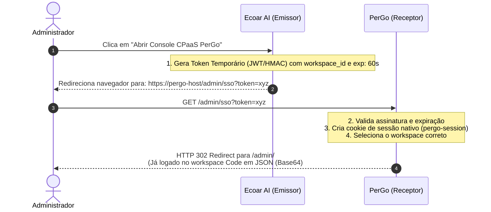

As alterações no PerGo não descaracterizam o projeto nem criam acoplamento com o   Ecoar. Pelo contrário: elas tornam o PerGo um produto Open Source muito mais   poderoso e "Headless-first" (capaz de ser controlado via API por qualquer frontend).

  As 4 melhorias recomendadas no PerGo são:            

    PerGo (Melhorias no Core Open Source)              
    ├── 1. POST /api/v1/devices/pair        --> Inicia pareamento e retorna QR Code em JSON (Base64)     
    ├── 2. GET  /api/v1/devices             --> Lista status das conexões (Online, Offline, Bateria, Telefone)                          
    ├── 3. POST /api/v1/workspaces          --> Criação programática de Workspace + API Key + Webhook Secret  
    └── 4. GET  /admin/sso                  --> Endpoint de Single Sign-On via Token Assinado            

  1. APIs REST de Conexões e QR Code (/api/v1/devices):
      • Hoje o pareamento com QR Code no PerGo é feito via telas HTMX (/admin/devices/pair).
      • Ao adicionar os endpoints REST POST /api/v1/devices/pair e GET/api/v1/devices/:id/qr retornando JSON, qualquer aplicação externa (como o Ecoar) consegue solicitar o QR Code e renderizá-lo onde quiser.
  2. Provisionamento Programático de Workspaces (POST /api/v1/workspaces):
      • Endpoint REST que recebe { "name": "Agência X" } e retorna { "id": "...", "api_key": "...", "webhook_secret": "..." }.
  3. Inscrição de Webhooks via REST API (POST /api/v1/workspaces/:id/webhooks/subscriptions):
      • Permite que o Ecoar se inscreva automaticamente para receber eventos de mensagens e status de conexões.
  4. Endpoint de SSO (GET /admin/sso):                 
      • Permite login via link temporário assinado criptograficamente.

  ──────
  ### 2. O Single Sign-On (SSO) seria no PerGo, no Ecoar ou em ambos?
  
  O SSO é implementado em AMBOS, pois é um handshake (aperto de mãos) seguro entre quem autentica o usuário (Ecoar) e quem concede o acesso ao painel (PerGo).

  ──────
  ### Como funciona a implementação em cada lado:
  
  #### A) No Ecoar AI (Lado Emissor):
  
  Quando um usuário com permissão administrativa clica no botão "Abrir Console Avançado do PerGo":
  
  1. O backend do Ecoar gera um token assinado (usando a mesma chave secreta PERGO_SESSION_SECRET configurada no ambiente):
    {
      "workspace_id": "uuid-da-agencia",
      "email": "admin@agencia.com",
      "exp": 1755198000
    }
  
  2. O Ecoar redireciona a aba do navegador para https://cpaas.ecoar.ai/admin/sso?token=<token_gerado>.
  
  #### B) No PerGo (Lado Receptor):
  
  O PerGo cria uma rota pública leve em internal/api/handler/admin/login.go:      
  
  1. Rota: GET /admin/sso
  2. Valida a assinatura do token e verifica se o tempo de 60 segundos não expirou.
  3. Se válido, chama o método existente middleware.SetSessionCookie(c, secret) e define o cookie pergo-active-workspace com o workspace_id que veio no token.
  4. Redireciona com HTTP 302 para /admin/.

  ──────
  ### 💡 Vantagens dessa abordagem:
  
  1. Zero atrito: O administrador não precisa saber qual é a senha mestra do PerGo nem memorizar outra credencial.
  2. Segurança total: Tokens duram apenas alguns segundos (anti-replay) e são assinados criptograficamente com HMAC-SHA256.
  3. 100% Desacoplado: O PerGo não precisa consultar o banco de dados do Ecoar; ele apenas valida a assinatura matemática do token recebido.
