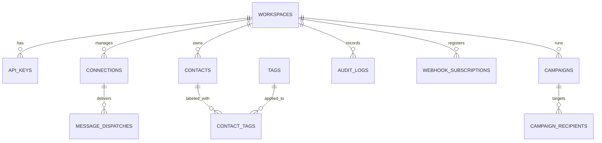

# Database Schema & Partitioning

PerGo uses **PostgreSQL 16** as its persistent storage engine. Schema migrations are managed and applied automatically at application startup using embedded SQL files via `pressly/goose`.

---

## 1. Entity-Relationship Overview



---

## 2. Core Tables

### `workspaces`
Tenant root entity. Isolates all API keys, contacts, dispatches, and webhooks.
- `id` (UUID, PK)
- `name` (VARCHAR)
- `webhook_secret` (VARCHAR) — Master secret used for signing outbound webhooks for this workspace.
- `flow_webhook_url` (VARCHAR) — Custom webhook URL for WhatsApp Interactive Flows.
- `created_at`, `updated_at` (TIMESTAMPTZ)

### `api_keys`
Scoped API keys for programmatic access.
- `id` (UUID, PK)
- `workspace_id` (UUID, FK -> `workspaces.id`)
- `key_prefix` (VARCHAR) — Plaintext key prefix (e.g. `pgo_live_...`) for UI identification.
- `key_hash` (BYTEA) — SHA-256 hash of the complete API key.
- `revoked_at` (TIMESTAMPTZ, NULLABLE)

### `connections`
Configured messaging channels (WhatsApp Web, WABA Cloud, Telegram, etc.).
- `id` (UUID, PK)
- `workspace_id` (UUID, FK)
- `channel` (VARCHAR) — `"whatsapp"`, `"whatsapp_cloud"`, `"telegram"`.
- `slug` (VARCHAR) — Workspace-unique identifier slug (e.g. `"support-bot"`, `"sales-line"`).
- `status` (VARCHAR) — `"connected"`, `"disconnected"`, `"pairing"`.
- `credentials_encrypted` (BYTEA) — Channel tokens and session keys sealed with AES-256-GCM using the system KEK.
- `metadata` (JSONB) — Phone number ID, display name, account status, etc.

### `message_dispatches`
Lifecycle tracking for all outbound messages.
- `id` (UUID, PK)
- `workspace_id` (UUID, FK)
- `connection_id` (UUID, FK)
- `trace_id` (VARCHAR, UNIQUE) — Distributed trace UUID correlated with ingress request.
- `provider_message_id` (VARCHAR) — Upstream network message identifier (e.g. WhatsApp `wamid`).
- `to_identifier` (VARCHAR) — Destination phone number or chat ID.
- `channel` (VARCHAR) — Channel used for final dispatch.
- `status` (VARCHAR) — `"queued"`, `"sent"`, `"delivered"`, `"read"`, `"failed"`.
- `created_at`, `updated_at` (TIMESTAMPTZ)

### `campaigns` & `campaign_recipients`
Broadcast engine for scheduled and bulk messaging dispatches.
- `campaigns`: Tracks execution state (`draft`, `scheduled`, `running`, `paused`, `completed`, `canceled`), delay ranges, rate limits per minute, and target tag filters.
- `campaign_recipients`: Recipient list with custom attribute overrides and dispatch status.

---

## 3. Audit Log Partitioning (`audit_logs`)

Compliance and security regulations (LGPD/GDPR) require an immutable audit trail of every state transition, authentication event, and message dispatch.

Under 500 req/s, the audit table grows by tens of millions of rows per month. To prevent table bloat and preserve query performance, `audit_logs` is **range-partitioned by timestamp (`created_at`)**:

```sql
CREATE TABLE audit_logs (
    id UUID NOT NULL,
    workspace_id UUID NOT NULL,
    trace_id VARCHAR(64) NOT NULL,
    event_type VARCHAR(64) NOT NULL,
    payload JSONB NOT NULL,
    created_at TIMESTAMPTZ NOT NULL,
    PRIMARY KEY (id, created_at)
) PARTITION BY RANGE (created_at);

-- Default partition catches events outside specific date partitions
CREATE TABLE audit_logs_default PARTITION OF audit_logs DEFAULT;
```

---

## 4. Encryption at Rest (AES-256-GCM Envelope Encryption)

Sensitive channel credentials (WhatsApp Web session keys, Meta permanent tokens, Telegram bot secrets) are encrypted before SQL insertion using AES-256-GCM authenticated encryption:

- **Key Encryption Key (KEK):** Provided via `PERGO_KEK_BASE64` (32 bytes Base64).
- **Nonce:** A unique 12-byte cryptographically secure random nonce is generated per encryption operation (`crypto/rand`).
- **Storage:** Stored in PostgreSQL as `nonce (12 bytes) || ciphertext || tag (16 bytes)`.
