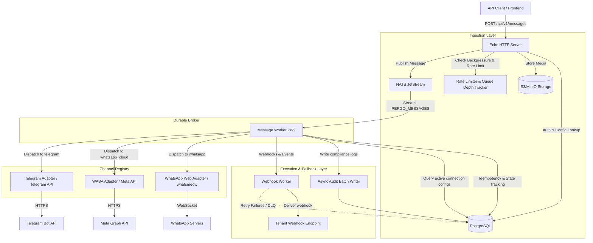

# PerGo Architecture Overview

PerGo is designed as a high-performance, self-hosted, open-source Omnichannel Communications Platform as a Service (CPaaS) gateway.

It provides a unified, developer-friendly REST API for dispatching and receiving messages across fragmented networks—**WhatsApp Web** (unofficial via `whatsmeow`), **WhatsApp Cloud** (official Meta WABA), and **Telegram**—while guaranteeing complete data custody, sovereignty, and carrier-grade durability.

---

## Architectural Principles

1. **No Premature Abstraction:** Interfaces are introduced only where multiple real implementations exist (e.g. channel adapters, audit sinks) or at pre-agreed testing seams.
2. **Explicit Constructor Injection:** Dependencies are explicitly passed via `NewX(deps...)` constructors without hidden runtime reflection or magic dependency injection frameworks.
3. **Durable Boundary:** NATS JetStream serves as the single durability boundary for outbound work. Anything acknowledged by the broker survives application crashes or restarts.
4. **PostgreSQL as System of Record:** PostgreSQL handles persistent identity (tenants, API keys, channel connections, contacts, campaigns) and partitioned audit trails, but is never used as a hot-path queue.
5. **Two I/O Calls on Ingestion:** The synchronous HTTP ingress path executes only two I/O operations: cached API key authorization and NATS JetStream publish. Everything else is processed asynchronously.

---

## Component Architecture

The following diagram illustrates how the core components of PerGo interface with each other and external messaging providers:

---

## Data Flow

### 1. Outbound Request Ingress
1. The API client submits `POST /api/v1/messages` with a workspace Bearer API Key.
2. `AuthMiddleware` verifies the API key against the in-memory cache or database.
3. If the payload contains media attachments, media is streamed to the configured S3-compatible bucket.
4. Backpressure tracker checks if the workspace has exceeded the 1,000 pending message limit; if exceeded, returns `HTTP 429 Too Many Requests`.
5. The message is tagged with a unique `Trace-Id` UUID and published to the `PERGO_MESSAGES` NATS JetStream stream.
6. The client receives an immediate `202 Accepted` response with the `Trace-Id` header and receipt payload within < 50ms.

### 2. Worker Dispatch & Fallback Execution
1. A worker from the consumer pool pulls the message from NATS JetStream.
2. **Idempotency Gate:** Verifies whether the `trace_id` or deduplication key has already been dispatched.
3. **Channel Execution:** Iterates through the primary channel and configured fallback channels (e.g. WhatsApp Web -> Telegram -> WABA).
4. For WhatsApp Web dispatches, a per-session token bucket limiter enforces a random 1–3 second delay to mimic human behavior.
5. On successful delivery, the external provider message ID (e.g. Meta `wamid`) is recorded in `message_dispatches`.
6. Audit log events are pushed to the bounded in-memory audit channel.
7. Message is acknowledged (`Ack`) to NATS JetStream. If transient failure occurs, `NakWithDelay` triggers exponential backoff retry.

### 3. Inbound Webhook Processing
1. Inbound events (incoming messages, delivery receipts, read statuses) hit `/webhooks/waba/:workspace_id` or `/webhooks/telegram/:workspace_id` (or WhatsApp Web WebSocket listener).
2. Webhooks are validated using cryptographic signatures or secret tokens.
3. Inbound processor updates `message_dispatches` status indicator and dispatches external subscriber webhooks with HMAC-SHA256 signatures (`X-PerGo-Signature`).

---

## Architecture Deep Dives

- **[Architectural Summary & PRD Analysis](summary.md)**: Non-functional targets, distributed systems challenges, and design posture.
- **[NATS JetStream Concurrency & Performance](concurrency.md)**: Worker pools, goroutines, backpressure mitigation, and rate limiting.
- **[Resilience & Error Handling](resilience.md)**: Circuit breakers, fallback routing, retry loops, and error conventions.
- **[Database Schema & Partitioning](database-schema.md)**: PostgreSQL schema, partitioned audit logs, and AES-256-GCM encryption.
- **[Directory Structure](directory-structure.md)**: Domain-oriented package structure and boundary seams.
- **[Core Code Examples](core-code-examples.md)**: Idiomatic Go patterns for ingestion, routing, and audit batching.
