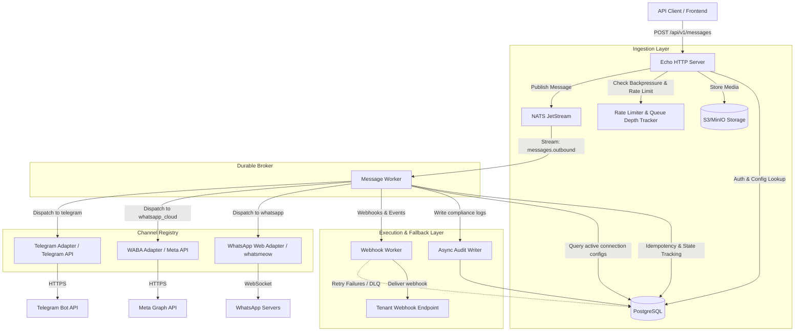

<!-- generated-by: gsd-doc-writer -->
# PerGo Architecture Overview

This document provides a comprehensive architectural overview of PerGo, a self-hosted, open-source Omnichannel Communications Platform as a Service (CPaaS) gateway.

## System Overview

PerGo is designed to expose a unified, developer-friendly REST API for sending and receiving messages across fragmented messaging networks (WhatsApp Web, WhatsApp Cloud/WABA, and Telegram). It operates under a self-hosted model, ensuring that the system operator retains full data custody and sovereignty (essential for compliance with GDPR, LGPD, and other privacy frameworks) without per-message markup costs.

Key goals and performance design constraints:
* **High-Throughput Ingestion**: Supports synchronous ingestion latency below 50ms p99. <!-- VERIFY: Production workloads support >= 500 messages/sec sustained throughput and <= 50ms p99 ingestion latency. -->
* **Backpressure Mitigation**: Limits queued messages per workspace to 1,000 to prevent system memory leaks.
* **Durable Delivery**: Message delivery guarantees are isolated from application-level restarts using a durable message broker boundary.
* **Fallback Routing**: Automatic fallback across multiple configured channels when a message fails terminally.
* **Compliance Audit Logging**: Batched, asynchronous recording of all transactions and state changes.

---

## Component Diagram

The following diagram illustrates how the core components of PerGo interface with each other and external messaging networks:



---

## Data Flow

### 1. Ingestion (`POST /api/v1/messages`)
1. **Request Ingress**: The API client hits `POST /api/v1/messages` (handled by [MessageHandler.Create](file:///home/pablo/Coding/PerGo/internal/api/handler/message.go#L50)).
2. **Context Enrichment**: The server injects a correlation Trace ID via `TraceMiddleware` and retrieves the workspace context from the `AuthMiddleware` (which validates the client's API key).
3. **Rate Limiting & Backpressure**: 
   - `RateLimiterMiddleware` checks workspace-level velocity limits.
   - `QueueDepthTracker` validates that the workspace's queued outbound message count has not exceeded 1,000. If exceeded, the request is immediately rejected with HTTP `429 Too Many Requests`.
4. **Media Handling**: If the payload contains media, the server downloads the media stream, validates its size (< 25MB), uploads it to the configured S3-compatible bucket, and updates the payload's `media_url` to an internal proxy endpoint (`/media/{workspace_id}/{hash}.{ext}`). <!-- VERIFY: PerGo relies on external S3-compatible storage (e.g. AWS S3 or MinIO) for media retention. -->
5. **Route Resolution**: The routing resolver ([ConnectionRepository](file:///home/pablo/Coding/PerGo/internal/repository/connection.go#L40)) checks the sender identity database config to map the request to a specific `ConnectionID` and verify channel compatibility.
6. **JetStream Enqueue**: The message payload is wrapped in a `QueueMessage` struct and published to NATS JetStream under the subject `messages.outbound` with the header `Nats-Msg-Id` set to the trace ID (ensuring broker-level deduplication).
7. **Ingress Response**: The server returns an HTTP `202 Accepted` status containing the generated message ID and `queued` status.

### 2. Queue & De-queue
- The NATS JetStream durability boundary decouples HTTP request acceptance from downstream execution. <!-- VERIFY: NATS server is configured with JetStream enabled to support the outbound message stream. -->
- The background [Worker](file:///home/pablo/Coding/PerGo/internal/platform/queue/worker.go#L18) pulls messages from the JetStream stream.

### 3. Outbound Execution, Fallback, & Webhooks
1. **Idempotency Check**: The worker queries the database via [MessageDispatchRepository](file:///home/pablo/Coding/PerGo/internal/repository/dispatch.go) to see if the trace ID has already been dispatched. If `sent`, the message is acknowledged (`Ack`) and discarded.
2. **TTL Verification**: The worker verifies if the message's custom TTL has expired relative to its ingestion time. If expired, it flags the dispatch as `failed`, pushes a webhook event, and acks the queue.
3. **Execution Loop**: The worker resolves the channel adapter via [channel.Registry](file:///home/pablo/Coding/PerGo/internal/channel/registry.go#L7). It iterates through the primary channel and any fallback channels:
   - **On Success**: The worker updates the database state to `sent`, notifies the `webhooks.events` channel, saves audit logs via the asynchronous audit recorder, and signals `Ack` to JetStream.
     - *WABA Provider ID Tracking*: If the successfully dispatched channel is `whatsapp_cloud`, the worker extracts the unique Meta message ID (`wamid`) from the HTTP response payload and associates it with the database record in `message_dispatches.provider_message_id` via [MessageDispatchRepository.UpdateProviderMessageID](file:///home/pablo/Coding/PerGo/internal/repository/dispatch.go#L123).
   - **On Transient Failure** (e.g., rate-limit, network timeout): The worker updates the DB state to `failed_transient` and sends a negative acknowledgment (`NakWithDelay`) to NATS to trigger exponential backoff redelivery.
   - **On Terminal Failure** (e.g., number not on WhatsApp, credentials invalid): The worker updates the state, logs the error, and falls back to the next channel in the payload's `fallback_channels` slice. If all fallbacks are exhausted, the status is set to `failed` and the message is acked.
4. **Webhook Dispatch**: The [WebhookWorker](file:///home/pablo/Coding/PerGo/internal/platform/queue/webhook_worker.go) reads webhook events from NATS and POSTs status updates back to tenant endpoints, routing failures to a Webhook DLQ in Postgres if delivery fails.

### 4. WABA Read Receipts & Status Webhooks
1. **Webhook Ingress**: Meta Graph API posts status receipts (e.g. `sent`, `delivered`, `read`, or `failed`) to the inbound webhook route (`/api/v1/webhooks/waba`).
2. **Payload Parsing**: The [WABAInboundAdapter](file:///home/pablo/Coding/PerGo/internal/channel/whatsapp/waba_inbound.go) parses the `statuses` array of the JSON webhook payload, mapping each entry into an `InboundEvent` with the metadata `type: status_update`, the `wamid` as the message ID, and the status value as the message body.
3. **Inbound Processing**: The [InboundProcessor](file:///home/pablo/Coding/PerGo/internal/inbound/processor.go#L128) intercepts events marked as `status_update`:
   - It bypasses contact resolution, recipient session tracking, and audit logging to avoid duplicate thread/contact creation.
   - It queries the database via `GetByProviderMessageID` to match the incoming `wamid` to the original `message_dispatches` record.
   - If found, it updates the dispatch status in the database using `UpdateDispatchStatus`.
   - It publishes a status update event (`MessageStatusUpdatedPayload`) to the NATS JetStream subject `messages.status_updated` for real-time notification downstream.

---

## Key Abstractions

PerGo enforces clear interfaces to isolate business rules from transport protocols and storage configurations:

* **[channel.Dispatcher](file:///home/pablo/Coding/PerGo/internal/channel/dispatcher.go#L35)**: The core interface for sending messages over a specific channel:
  ```go
  type Dispatcher interface {
      Dispatch(ctx context.Context, m *MessagePayload) (string, error)
  }
  ```
  This is implemented by the WhatsApp Web Adapter ([WhatsAppAdapter](file:///home/pablo/Coding/PerGo/internal/channel/whatsapp/adapter.go#L36)), WhatsApp Cloud Adapter ([WABAAdapter](file:///home/pablo/Coding/PerGo/internal/channel/whatsapp/waba.go)), and Telegram Adapter ([TelegramAdapter](file:///home/pablo/Coding/PerGo/internal/channel/telegram/telegram.go)).
* **[channel.Registry](file:///home/pablo/Coding/PerGo/internal/channel/registry.go#L7)**: A concurrent-safe map of string channel identifiers to their respective `Dispatcher` implementations.
* **[session.ActiveSession](file:///home/pablo/Coding/PerGo/internal/session/registry.go#L23)**: An in-memory mapping of active WhatsApp JIDs to stateful multi-device WebSocket connections (`whatsmeow`).
* **[session.Manager](file:///home/pablo/Coding/PerGo/internal/session/manager.go#L34)**: Co-ordinates WhatsApp Web device lifetimes. Handles concurrent reconnection throttling (limiting startup stampedes), listens to incoming message events, downloads media, and publishes incoming events to NATS.
* **[repository.ConnectionRepository](file:///home/pablo/Coding/PerGo/internal/repository/connection.go#L40)**: Manages persistence of workspace credentials. Handles transparent AES-256-GCM envelope encryption/decryption of channel credentials using a Key Encryption Key (KEK).
* **[repository.MessageDispatchRepository](file:///home/pablo/Coding/PerGo/internal/repository/dispatch.go#L35)**: Manages outbound message lifecycle states inside the `message_dispatches` table. Features queries to map external provider message IDs (e.g., WhatsApp `wamid`) to internal dispatches (`UpdateProviderMessageID`, `GetByProviderMessageID`) and update dispatch statuses (`UpdateDispatchStatus`).
* **[inbound.InboundProcessor](file:///home/pablo/Coding/PerGo/internal/inbound/processor.go#L93)**: Coordinates processing of incoming message events and system status update notifications. Resolves contact identities and sessions for user messages, but routes provider status changes directly to the dispatch repository and NATS JetStream, bypassing unnecessary database lookups and duplication.
* **[repository.AuditRepository](file:///home/pablo/Coding/PerGo/internal/repository/audit.go#L36)**: Handles loading of historical logs and unified threads. Its `ListThreadByContact` method runs queries joining the `audit_logs` table with `message_dispatches` to return the status indicator of outbound messages.
* **[audit.Writer](file:///home/pablo/Coding/PerGo/internal/platform/audit/batch.go#L15)**: A high-performance async logging recorder. Implemented by [BatchWriter](file:///home/pablo/Coding/PerGo/internal/platform/audit/batch.go#L47), it streams audit logs into an in-memory buffer channel, allowing background workers to execute bulk database writes via `pgx.CopyFrom` to satisfy latency constraints.

### UI Delivery Indicators
The Inbox dashboard UI components ([chat_panel.templ](file:///home/pablo/Coding/PerGo/templates/components/chat_panel.templ) and [message_bubble.templ](file:///home/pablo/Coding/PerGo/templates/components/message_bubble.templ)) read the `status` string from the thread message records to render corresponding visual checkmarks:
- **`sent`**: Rendered as a single gray checkmark.
- **`delivered`**: Rendered as two gray checkmarks.
- **`read`**: Rendered as two cyan checkmarks.
- **`failed`**: Rendered as a warning symbol `⚠️`.
- **Other/queued/sending**: Rendered as an opaque single checkmark.

---

## Directory Structure Rationale

PerGo organizes its codebase into clean domain-oriented packages inside the `/internal` folder rather than traditional horizontal MVC layers. This ensures dependency isolation and ease of navigation:

* **[cmd/](file:///home/pablo/Coding/PerGo/cmd)**: The composition root. It contains the server entry point ([cmd/pergo/main.go](file:///home/pablo/Coding/PerGo/cmd/pergo/main.go)), where config is parsed, dependencies are wired, database/broker integrations are established, and the HTTP server/workers are spun up under a central graceful shutdown manager.
* **[internal/api/](file:///home/pablo/Coding/PerGo/internal/api)**: Handles HTTP boundaries. Houses endpoint handlers (such as message ingestion and webhook listeners for Telegram/Meta) and middlewares (auth, backpressure queue-depth monitoring, and rate limiting).
* **[internal/channel/](file:///home/pablo/Coding/PerGo/internal/channel)**: Integrates downstream channel providers. It defines adapter implementations for `whatsapp` (whatsmeow client wrapper), `whatsapp_cloud` (Meta Cloud API client), and `telegram` (Telegram Bot client).
* **[internal/config/](file:///home/pablo/Coding/PerGo/internal/config)**: Defines configuration structures and environment loaders mapped against a 12-factor application structure.
* **[internal/domain/](file:///home/pablo/Coding/PerGo/internal/domain)**: Holds core business models (e.g. `CreateMessageRequest`, `QueueMessage`, `MessageStatus`) and standard request validations.
* **[internal/platform/](file:///home/pablo/Coding/PerGo/internal/platform)**: Reusable, infrastructure-specific abstractions that contain zero business logic. This includes the database connection pool config, cryptographical envelope routines, S3 storage wrappers, JetStream broker streams setup, NATS workers, and logging formats.
* **[internal/repository/](file:///home/pablo/Coding/PerGo/internal/repository)**: Implements all data-access persistence operations (API keys, dispatches, compliance logs, configurations) directly utilizing `pgx/v5`.
* **[internal/session/](file:///home/pablo/Coding/PerGo/internal/session)**: Encapsulates stateful connection management for WhatsApp Web sessions, including device storage repositories, session registration, QR pairing sequences, and sliding delivery window calculations.
* **[templates/](file:///home/pablo/Coding/PerGo/templates)**: Embeds the static layouts and Templ components utilized to render the server-side operator dashboard console.
* **[static/](file:///home/pablo/Coding/PerGo/static)**: Static asset resources (CSS, JS, images) required by the Templ operator UI dashboard.
