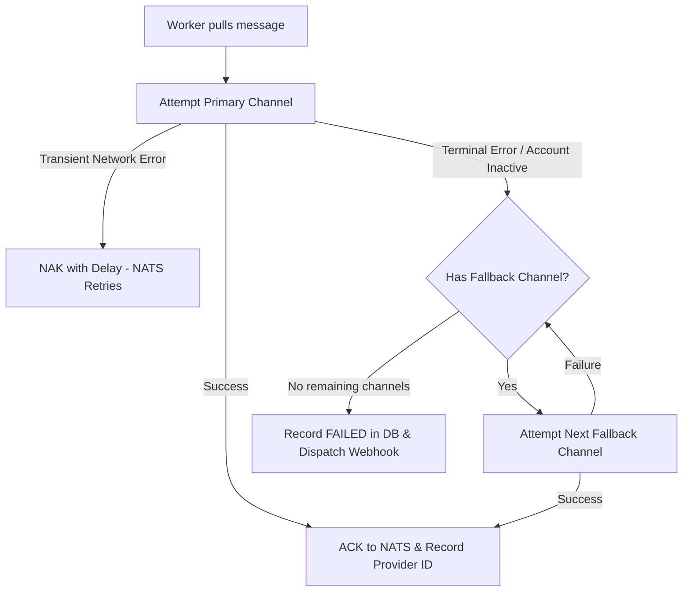

# Resilience & Error Handling

PerGo incorporates multi-layered fault tolerance to maintain service continuity even when external messaging networks experience degraded performance or outages.

---

## 1. Error Handling & Sentinel Definitions

All errors are wrapped at package boundaries using `fmt.Errorf("operation: %w", err)`. Callers identify failure modes using `errors.Is` or `errors.As` against exported sentinels:

```go
package domain

import "errors"

var (
    ErrQueueFull        = errors.New("queue full: backpressure limit reached")
    ErrNoActiveChannel  = errors.New("no active channel connection available")
    ErrAllFallbacksFail = errors.New("delivery failed across all configured fallback channels")
    ErrInvalidPayload   = errors.New("invalid or malformed request payload")
    ErrUnauthorized     = errors.New("invalid or missing authentication credentials")
)
```

### HTTP Status Code Mappings

| Error Condition | HTTP Status | Behavior |
| :--- | :--- | :--- |
| Malformed JSON or validation failure | `400 Bad Request` | Synchronous reject; client must fix payload. |
| Invalid API key or expired session | `401 Unauthorized` | Synchronous reject. |
| Workspace access violation | `403 Forbidden` | Synchronous reject. |
| Per-workspace queue depth > 1,000 | `429 Too Many Requests` | Returns `Retry-After: 5` header; client should throttle. |
| Ingestion successful | `202 Accepted` | Message accepted and enqueued; returns `trace_id`. |
| Unrecoverable downstream failure | Logged to DLQ | Triggers fallback channel or dead letter queue. |

---

## 2. I/O Timeouts

Every I/O interaction enforces an explicit context deadline:

| Operation | Timeout | Enforcement Mechanism |
| :--- | :--- | :--- |
| **HTTP Request Parsing** | 2 seconds | `http.Server.ReadTimeout` |
| **NATS JetStream Ingress Publish** | 1 second | `context.WithTimeout` on publish |
| **JetStream Worker Pull Batch** | 5 seconds | `PullMaxWait` configuration |
| **Outbound Provider REST (WABA, Telegram)** | 10 seconds | Configured on `http.Client{Timeout: 10s}` |
| **Outbound Webhook Delivery** | 5 seconds | Per-request timeout with exponential backoff |
| **PostgreSQL Pool Acquisition** | 3 seconds | `pgxpool` configuration parameter |

---

## 3. Fallback Channel Routing Pipeline

When sending messages via `POST /api/v1/messages`, clients can specify fallback channels:

```json
{
  "to": "5511999999999",
  "channel": "whatsapp",
  "fallback_channels": ["whatsapp_cloud", "telegram"],
  "body": "Your verification code is 482910."
}
```



1. **Primary Attempt:** The worker resolves the connection for the primary channel and attempts dispatch.
2. **Transient vs. Terminal Failure:**
   - **Transient failures** (e.g. temporary network blips, 502/503 from provider): The message is NAK'd with exponential delay (`NakWithDelay`) to let JetStream redeliver after a cooldown.
   - **Terminal failures** (e.g. number banned, invalid recipient format, unregistered template): The worker advances to the next channel in `fallback_channels`.
3. **Exhaustion:** If all configured channels fail, the dispatch status is finalized as `failed` and logged to the audit repository.

---

## 4. Webhook Retries & Dead Letter Queue (DLQ)

When notifying external tenant endpoints about status updates or inbound events:
- Outbound webhooks are signed with `X-PerGo-Signature` (HMAC-SHA256).
- Failures (HTTP 5xx, timeouts, connection drops) are retried with exponential backoff (e.g. 5s, 15s, 60s, 300s).
- If maximum delivery attempts are exhausted, the payload is persisted to the `webhook_dlq` table for inspection and manual re-delivery from the admin console.
