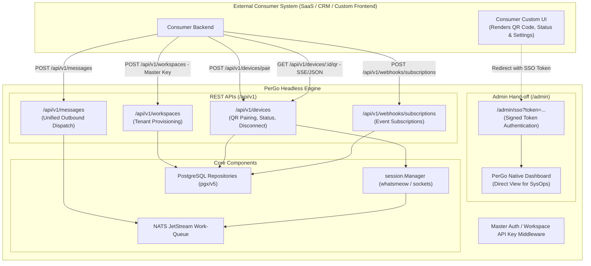
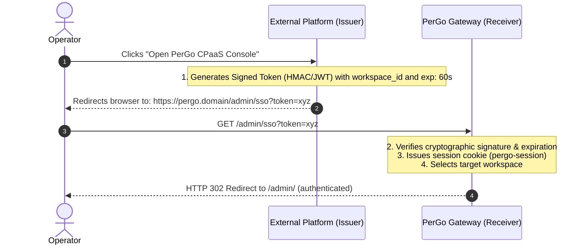

# PerGo Headless CPaaS & Integration APIs Specification

**Document Type:** RFC / Architectural Roadmap & Technical Specification  
**Target Repository:** `PerGo` (Omnichannel Communications Platform as a Service)  
**Status:** Approved for Implementation  

---

## 1. Overview & Motivation

PerGo is an open-source, self-hosted Communications Platform as a Service (CPaaS) engineered in Go. It provides a unified messaging API (`POST /api/v1/messages`) alongside a server-rendered operator console (`/admin/*`) built on `a-h/templ` and HTMX.

To support scenarios where external consumer systems (CRMs, ERPs, SaaS platforms, AI orchestrators, helpdesks) need to embed communications in a **100% headless** architecture without redirecting users to the PerGo UI, PerGo provides standardized REST APIs (`/api/v1/`) for operations previously exclusive to the admin interface.

Additionally, to allow operators to transition seamlessly into the native PerGo operator console when required, a secure **Single Sign-On (SSO) / Seamless Hand-off** mechanism is provided.

---

## 2. Headless Architecture Diagram



---

## 3. Specification Modules

### 3.1 Module 1: Programmatic Tenant Workspace Provisioning
Enables external platforms to provision and configure tenant workspaces dynamically.

- **Authentication:** `Authorization: Bearer <PERGO_MASTER_KEY>` or `X-Master-Key: <PERGO_MASTER_KEY>`.
- **Endpoint:** `POST /api/v1/workspaces`

#### Request:
```json
{
  "name": "Acme Corp",
  "generate_api_key": true,
  "generate_webhook_secret": true
}
```

#### Response (`HTTP 201 Created`):
```json
{
  "id": "a5e8c1b2-3f4d-4e5a-8b9c-0d1e2f3a4b5c",
  "name": "Acme Corp",
  "api_key": "pgo_live_8f3d1b9a7c2e4f0a1b2c3d4e5f6a7b8c",
  "webhook_secret": "whsec_9a8b7c6d5e4f3a2b1c0d9e8f7a6b5c4d",
  "created_at": "2026-08-14T18:00:00Z"
}
```

---

### 3.2 Module 2: Headless Connection Lifecycle & Device Pairing (`/api/v1/devices`)
Allows initiating WhatsApp Web (`whatsmeow`) sessions, fetching QR codes for remote rendering, monitoring connection states, and disconnecting devices.

#### 1. Initiate WhatsApp Web Pairing
- **Endpoint:** `POST /api/v1/devices/pair`
- **Headers:** `Authorization: Bearer <WORKSPACE_API_KEY>`

##### Request:
```json
{
  "channel": "whatsapp",
  "phone": "5511999999999",
  "name": "Support WhatsApp Line",
  "proxy_url": ""
}
```

##### Response (`HTTP 200 OK`):
```json
{
  "connection_id": "7b1c3d5e-9f8a-4b2c-8d1e-0a2b3c4d5e6f",
  "phone": "5511999999999",
  "status": "pairing_started",
  "message": "Session initialized. Retrieve QR code via polling or SSE stream."
}
```

#### 2. Get QR Code (Polling)
- **Endpoint:** `GET /api/v1/devices/:id/qr`
- **Response (`HTTP 200 OK`):**
```json
{
  "status": "pending",
  "code": "2@vJ8...base64rawstring...",
  "qr_data_url": "data:image/png;base64,iVBORw0KGgoAAAANSUhEUgAA...",
  "expires_at": "2026-08-14T18:01:25Z"
}
```

#### 3. Real-Time QR Code Stream (Server-Sent Events - SSE)
- **Endpoint:** `GET /api/v1/devices/:id/qr/stream`
- **Header:** `Accept: text/event-stream`
- **Events Emitted:**
  - `event: qr` -> JSON payload with refreshed QR code on every 20-second rotation.
  - `event: paired` -> Emitted when companion device successfully scans the code.
  - `event: error` -> Emitted on timeout or connection rejection.

#### 4. List Active Connections
- **Endpoint:** `GET /api/v1/devices`
- **Response (`HTTP 200 OK`):**
```json
{
  "connections": [
    {
      "id": "7b1c3d5e-9f8a-4b2c-8d1e-0a2b3c4d5e6f",
      "name": "Support WhatsApp Line",
      "slug": "support-line-1",
      "channel": "whatsapp",
      "sender_identity": "5511999999999",
      "status": "connected",
      "battery_level": 88,
      "connected_since": "2026-08-14T15:30:00Z"
    }
  ]
}
```

---

### 3.3 Module 3: Programmatic Webhook Subscriptions
Enables integrating systems to register webhook endpoints for message and connection events.

- **Endpoint:** `POST /api/v1/workspaces/:workspace_id/webhooks/subscriptions`
- **Request:**
```json
{
  "url": "https://api.consumer.com/webhooks/pergo",
  "events": [
    "message.received",
    "message.delivered",
    "message.failed",
    "connection.status"
  ],
  "is_active": true
}
```

---

### 3.4 Module 4: Single Sign-On (SSO) Hand-off

Enables administrators from an external authenticated SaaS portal to transition directly into the PerGo operator console without re-entering passwords:


